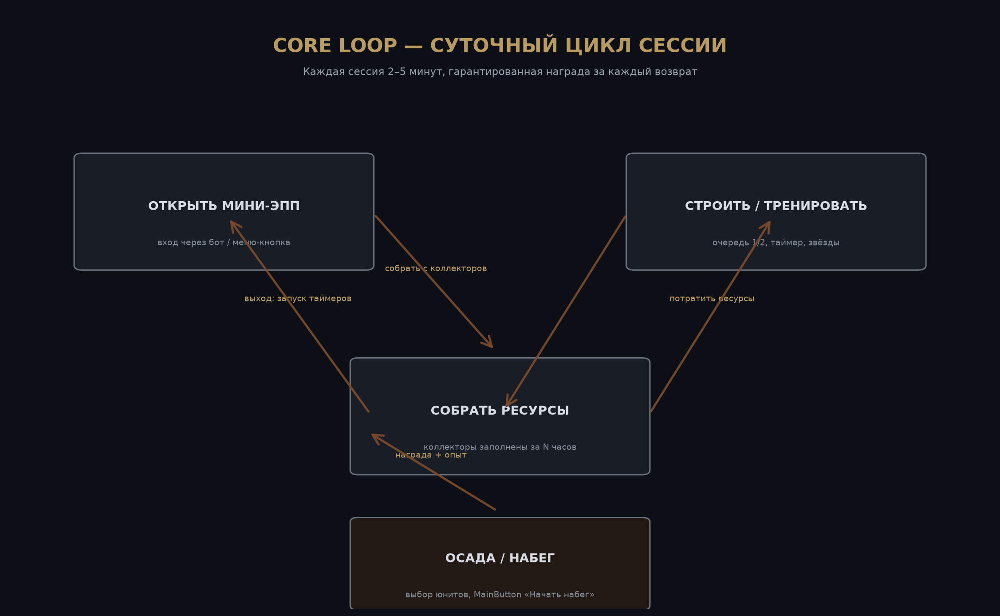
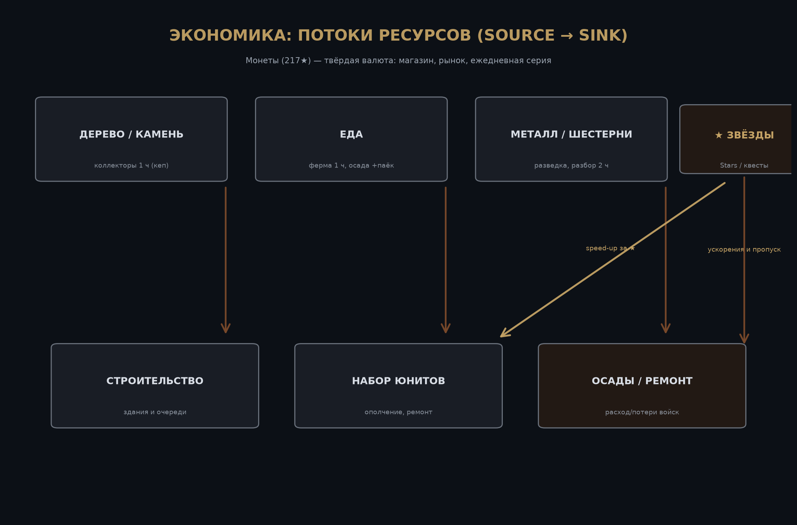

# Siege City Survival — Design: Telegram Mini App

**Документ:** UI/UX и дизайн-спецификация Mini App (v1.0.0)
**Дата:** 14 августа 2026
**Автор:** Manus AI
**Репозиторий:** [darker7778-ai/siege-city-survival](https://github.com/darker7778-ai/siege-city-survival)
**Стиль:** `artwork/style-card.md` v1.1.0 — This War of Mine (11 bit studios, 2014), утверждён пользователем
**Сопутствующие пакеты:** Graphic Asset Pack v1.1.0 (`artwork/`)
**Версия:** 1.0.0 | **Ревизия:** 2026-08-14 | **Статус:** Draft for review
<!-- Version 1.0.0 (revision 2026-08-14) — keep this marker for doc validation -->

## История версий

| Версия | Дата | Изменения |
|---|---|---|
| 1.0.0 | 2026-08-14 | Первая полная спецификация Mini App: визион, core loop, 5 систем, экономика, монетизация Stars, UI/UX-мокапы, карта экранов, приёмочные критерии |

---

## 1. Визион (one-page)

**Жанр:** survival-city-builder с async-PvP-осадами внутри Telegram Mini App (web-view в мессенджере).

**Фэнтези игрока.** Ты — староста выживших в осаждённом городе. Вечер, сирены смолкли, и ты открываешь Telegram, чтобы проверить свой квартал: собрать дрожащее под луной тепло печей, отправить ополченцев в обход вражеских руин, подписать приказ на укрепление казарм. Город растёт и хорошеет у тебя на глазах — из чёрных остовов в островок жизни, где каждое окно — чей-то чужой дом, а ты держишь свет включённым.

**Дизайн-пиллары.**

| Пиллар | Формулировка | «Значит, мы всегда / никогда…» |
|---|---|---|
| P1 — Ночь и свет | Мрачная обесцвеченная ночь, тёплый свет — редкая награда | Мы всегда делаем «собрать ресурс» визуально тёплым моментом (амбарный свет, искры); никогда не делаем интерфейс весёлым и нежным |
| P2 — Короткая сессия, честный возврат | Возврат в игру всегда вознаграждается, сессия 2–5 минут | Мы всегда даём гарантированный сбор в начале сессии; никогда не наказываем игрока за отсутствие (ресурсы хранятся, таймеры спят) |
| P3 — Живое сообщество в Telegram | Социальность живёт в самом мессенджере, не внутри башни из слоновой кости | Мы всегда проектируем альянс как мост к Telegram-группе; никогда не делаем чат изолированной копией, скрывающейся в отдельной вкладке |

**Дифференциаторы против трёх названных конкурентов.**

| Конкурент | Что он делает | Чем SCS отличается |
|---|---|---|
| State of Survival (FunPlus, 2019, iOS/Android) | Зомби-выживание с альянс-рейдами; тяжёлое full-app-приложение | SCS запускается за 1.5–2 секунды в Telegram без установки, вход — одно касание, нет friction аккаунта [2] |
| Hamster Kombat (2024, TMA) | Тап-менеджер биржи, 300M+ установок, карточный апгрейд-прогресс | SCS имеет настоящий визуальный город, который трансформируется, а не список карточек; эмоциональный сеттинг вместо офисной метафоры [2] |
| Zoo (2025, TMA) | Сити-билдер + альянсы с коллективными бонусами | SCS добавляет вечерние осады и PvP-набеги (социальная конкуренция, которой у Zoo нет) при сохранении альянс-ускорителей [2] |

---

## 2. Контекст проекта

**Платформа.** Telegram Mini App (web, HTML5/JS/CSS) внутри контейнера мессенджера; точки входа — меню-кнопка бота, inline-кнопки в чате, deep links в уведомлениях бота [1]. Мини-приложение работает только вертикально, на весь экран (fullscreen-режим Bot API 8.0+, safeArea соблюдается) [1]. Целевые устройства — только смартфоны (9:16), десктоп-версия Telegram получает центрированную вертикальную вёрстку.

**Экосистема Telegram.** По состоянию на 2026 год Telegram достиг ~1 млрд MAU и 2,5 млн новых пользователей в день; более 70% пользователей Telegram из СНГ регулярно используют Mini Apps; 53,5% аудитории — 18–34 лет [2] [3]. Это определяет три проектных решения: zero-friction onboarding (нет отдельной регистрации — профиль Telegram), мгновенный запуск (≤2 с, skeleton-screen вместо спиннера [4]) и реинжиниринг retention через уведомления бота с deep links.

**Стадия разработки.** Дизайн до кода: репозиторий содержит пакет графики v1.1.0 (`artwork/`) и этот дизайн-документ (`design/`); бэкенд-бот и фронтенд Mini App — следующий milestone (v0.1 MVP).

**Стек MVP (рекомендация, зафиксирована для исполнителя).** Бот: Python 3.12 + aiogram 3.x. Mini App: React + TypeScript + Vite, Telegram Web Apps SDK, TailwindCSS с палитрой из style-card. БД: PostgreSQL (профили, здания, очереди, осады). Кэширование таймеров: Redis. Хранение ассетов: S3-совместимое (Static Files CDN) — PNG-ассеты из `artwork/assets/` загружаются в `/assets` Mini App.

---

## 3. Core Loop

Основной цикл записан как последовательность глаголов: **открыть → собрать → построить/тренировать → осадить → выйти с запущенными таймерами.**

Дизайн цикла опирается на проверенную трёхкольцевую структуру Clash of Clans: короткое кольцо (сбор ресурсов, 2–5 минут) формирует привычку «зайти несколько раз в день», среднее кольцо (очередь строительства) удерживает игрока между сессиями, длинное кольцо (осады и альянс) даёт цель на недели [7] [8]. Паттерн «очередь перед сном» («заполнил очередь — утром зашёл, забрал, напал») переносится в Telegram напрямую: уведомления бота играют роль push-уведомлений CoC, только с zero-cost доставкой [8]. В отличие от CoC, SCS не потребляет все атакующие войска при проигрыше — осада возвращает уцелевших ополченцев (урон 40–70%), что снижает фрустрацию новичков и соответствует уроку Kabam Edgeworld [8].

Каждая сессия строится по tiers из разбора CoC: Tier 1 (2–5 минут) для нового игрока без всякого трения, Tier 2 — несколько возвратов в день (кепы коллекторов), Tier 3 — ежедневная осада/очередь [7].

---

## 4. Системы

### 4.1 Город и строительство

Город игрока — сетка 6×8 клеток с разрушенными «домами-призраками» (статичный декор из ассета `tile-ground.png`) и четырьмя активными зданиями. Визуальная трансформация города — отдельный механизм прогрессии: с каждым уровнем здания меняется его арт (5 стадий перерисовки, см. ассеты `bldg-*`), что реализует принцип CoC «start small, end epic» как главный визуальный драйвер удержания [8].

**Здания MVP.** Командный штаб (HQ, разблокировывает уровни всех остальных зданий), лесопилка (коллектор дерева), каменоломня (коллектор камня), казармы (наём и тренировка ополчения). Еда-ферма и металло-склад — milestone v0.2.

**Механика очереди.** Строительство работает как FIFO-очередь размером 2 слота: игрок запускает улучшение → таймер → уведомление бота «Постройка завершена». Дополнительный слот очереди продаётся за Stars (мягкий paywall, см. раздел 6). Цены и время растут экспоненциально с уровнем здания — это стандартное решение CoC, предотвращающее гринд одного здания через перекрёстную зависимость (HQ-гейт + ресурсы другого типа) [8].

**Стартовые параметры (зафиксированы для MVP-баланса):** штаб Ур.1 → Ур.2 стоит 120 дерева + 60 камня, таймер 25 минут; лесопилка Ур.1 → Ур.2 — 80 дерева + 40 камня, 15 минут. Все константы вынесутся в `config/economy.yaml` бэкенда.

### 4.2 Ресурсы и таймеры

Четыре мягкие валюты: **дерево, камень, еда, металл**, плюс твёрдая валюта **монеты** (иконка — приглушённые бронзовые монеты, ассет `icon-gold.png`) и премиум-валюта **Telegram Stars**.

Каждое здание-коллектор производит ресурс со скоростью, зависящей от уровня, до жёсткого кепа (cap). Возврат игрока всегда вознаграждается сбором накопленного — автоматический фарм с кепом, как у CoC, адаптированный под таймер-идиому Telegram-игр Time Farm («собрать раз в N часов») [2] [8]. Кеp лесопилки Ур.1 — 4 часа продукции; при переполнении производство останавливается, но ресурс не теряется. Скорости: лесопилка Ур.1 — 12/час, каменоломня Ур.1 — 6/час, ферма Ур.1 — 8/час (v0.2).

Главная кнопка экрана «СОБРАТЬ РЕСУРСЫ» (мокап `ui-main-city-mockup.png`) — основной жест возврата в игру, всегда доступен и всегда даёт мгновенную награду с хэптиком `impact("medium")`.

### 4.3 Юниты и осады

Единственный тип юнита MVP — **ополчение** (спрайт `unit-militia.png`): набор в казармах, лимит — слоты военного лагеря, растущие с уровнем казарм (Ур.1 → 20 юнитов). Еда — поддерживающий ресурс: при нехватке еды набор юнитов блокируется (мотивация строить ферму, v0.2).

**Осада = async-PvP-набег.** Игрок выбирает состав (до 100% ополчения), нажимает MainButton «Начать набег» (мокап `ui-siege-mockup.png`), и атака уходит в асинхронный расчёт: армия противника — реально построенный город противника в момент атаки. Расчёт: мощь атаки = Σ(юниты × сила) × бонус альянса; защитная мощь = гарнизон + стены. Результат через 3–60 минут (зависит от расстояния): награда лута (до 20% ресурсов нарушителя), опыт, частичное возвращение уцелевших (потери 40–70%). Провал не обнуляет армию — осадная экономика следует уроку Edgeworld [8], а не жёсткому потреблению CoC [8].

**Щит новичка.** Первые 3 дня игры и 12 часов после любой защиты город защищён «мирным флагом»: на него нельзя напасть. Это прямой перенос практики CoC против оттока новичков [8].

### 4.4 Социальное: альянсы через Telegram-группы

Альянс создаётся привязкой к существующей Telegram-группе: лидер альянса отправляет ссылку группы боту, бот становится админом/участником группы. Это решает главный задокументированный провал CoC — «кланы, которые не clash'ят»: у CoC кланы не имели реальных инструментов координации, кроме чата [8]. В SCS альянс = группа с ботом-диспетчером:

| Функция | Механика | Источник практики |
|---|---|---|
| Общий чат | Нативный чат Telegram-группы | нулевая разработка, привычная среда |
| Осада-рейд | Ежедневный «бой за район»: суммарный урон всех членов, лидерборд | альянс-рейды State of Survival [9], коллективные бонусы Zoo [2] |
| Ускорение друга | Член альянса может подарить speed-up за Stars, альянс-бонус +10% к производству | troop-donation CoC, но с реальной ценностью |
| Уведомления | Бот в группе сообщает: «Группа Б начинает рейд через 1 час», «Ваш альянс защитил склад» | service-реассы Telegram [4] |

### 4.5 Бот-слой: уведомления и re-engagement

Бот и Mini App — единая система. Бот шлёт уведомления только после контекстного opt-in (запрос разрешения всплывает после первого завершённого сбора, а не при первом запуске — рекомендованный паттерн TMA [4]). События: завершение строительства/тренировки, заполнение кепов коллекторов, результат осады, еженедельный итог альянса, ежедневный квест. Каждое уведомление — сообщение с inline-кнопкой deep link, открывающей Mini App на конкретном экране (`tg.openLink` с параметром `screen=collect`). Квота Bot API 30 сообщений/сек учитывается при массовых рассылках [4].

Ежедневный квест в чате («Собери 200 ресурсов — получи 1★-монету»): серия дней увеличивает награду (стрик 7 дней), что повторяет проверенный паттерн Notcoin/Yescoin «daily activity task» [2].

---

## 5. UI/UX-спецификация

### 5.1 Карта экранов

| Экран | Путь входа | Основной жест |
|---|---|---|
| Загрузка | меню-кнопка бота | skeleton-screen из `banner-loading.png` |
| Город (главный) | любой вход | «СОБРАТЬ РЕСУРСЫ» (MainButton), таб-навигация |
| Постройки | таб-кнопка «молот» | «УЛУЧШИТЬ» в карточке здания |
| Ополчение | таб-кнопка «два бойца» | «НАЧАТЬ НАБОР» |
| Осада | таб «два бойца» → кнопка «ОСАДА» | «НАЧАТЬ НАБЕГ» (MainButton, ClosingConfirmation) |
| Альянс | таб-кнопка «флаг» | «БОЙ ЗА РАЙОН» |
| Магазин | кнопка «★» в верхнем баре | покупка speed-up / слота очереди / монет |

Мокапы экранов построек, осады и альянса (`ui-build-menu-mockup.png`, `ui-siege-mockup.png`, `ui-alliance-mockup.png`) сгенерированы отдельно и будут добавлены в `assets/` отдельным коммитом; текстовые спецификации экранов выше в документе самодостаточны и не зависят от этих картинок.

### 5.2 Нативность Telegram-контейнера (обязательные правила)

Эти правила перенесены из свежих (март 2026) практических руководств по TMA и зафиксированы как жёсткие требования к вёрстке [4] [1]:

1. **`ready()` вызывается немедленно** после рендера skeleton-экрана — никакого «мигания» интерфейса [4].
2. **Цветовая синхронизация через `themeParams`** отклонена сознательно: игра использует фиксированную ночную палитру style-card (светлая тема Telegram не применяется к игровой сцене); синхронизация применяется только к оверлеям и диалогам Telegram. Это осознанное отклонение тренда: художественная палитра — часть визиона, и пользователь не должен видеть «белый город» днём.
3. **MainButton (нативная кнопка Telegram)** используется для самого важного действия экрана («Собрать», «Начать набег»); вторичные действия — внутри вёрстки. Состояния loading/disabled обязательны против двойного тапа [4].
4. **HapticFeedback:** `impact("light")` на каждый тап по карточке, `impact("medium")` на сбор ресурсов и победу в осаде, `notification("error")` на ошибку [1] [4].
5. **ClosingConfirmation** включается на экране осады и в процессе покупки Stars — защита от случайного свайп-закрытия [4].
6. **Горизонтальные элементы** не размещаются ближе 24px к краям экрана — защита от iOS edge-swipe закрытия контейнера [4].
7. **Skeleton-загрузка** стилизована под `banner-loading.png` (панель-скелет цвета `#1A1E26` с пульсирующим контуром).

### 5.3 Персонализация и онбординг

При первом запуске Mini App показывает «Привет, [имя из Telegram]» над заставкой — мгновенная персонализация без регистрации [4]. Онбординг занимает ≤5 минут и следует сценарию первого потока CoC: защита своего города (туториал-набег ИИ-грабителей), затем сбор, затем постройка, затем второй набег, затем ачивки-квесты [8]. По завершении онбординга всплывает contextual opt-in на уведомления («Сообщить, когда постройка завершена?») [4].

---

## 6. Экономика и монетизация (Telegram Stars)

**Экономика Stars.** Stars покупаются пользователями через Apple Pay/Google Pay без выхода из Telegram; курс ≈ $0.013–0.015 за Star; комиссия 30% (Apple/Google), которая становится ≈0%, если Stars реинвестировать в Telegram Ads [3]. Стартовые пакеты: 50 / 250 / 1250 Stars.

**Soft paywall, а не pay-to-win.** По данным 2026 года 90% покупок происходит в первую сессию, а недельные абонементы конвертируются в 5,4 раза лучше годовых [3]. SCS монетизирует три продукта:

| Продукт | Цена | Назначение |
|---|---|---|
| Speed-up (5/15/60 минут) | 5 / 12 / 40 Stars | пропуск таймера постройки/набора |
| Слот очереди +1 | 100 Stars (разово) | второй параллельный строитель |
| Сезонный пропуск «Осада: сезон 1» (4 недели) | 90 Stars/неделя (5,4× конверсия недельных планов [3]) | ежедневные задания, косметика-флаги, +15% к опыту |

Косметика — флаги альянса, цвет окна штаба, рамка аватара — продаётся только за Stars и не влияет на баланс (защита от pay-to-win-оттока). День-0 оффер всплывает после онбординга: «Набор выжившего — 50 Stars» [3].

**Потоки валют.** Мягкие ресурсы не продаются за Stars напрямую (это убивает баланс [3]); Stars конвертируются только во время и косметику. Монеты — внутриигровая твёрдая валюта: выдаются за квесты и осады, тратятся на ремонт и рынок между игроками (v0.2).

**Риски и анти-паттерны.** Задокументированный провал Telegram-игр 2024 года — airdrop-only механики без реальной игры: после окончания раздачи удержание падает до нуля [3]. SCS сознательно не привязывает монетизацию к крипто-наращиванию; Stars остаются закрытой экономикой цифровых товаров.

---

## 7. Аудио-направление

Звуковой язык следует стилю: тишина как основа, редкие тёплые звуки как акценты. Diegetic: треск костра, ветер, далёкие сирены, скрип дерева, глухой барабан при набегах. Non-diegetic: низкий drone-эмбиент в меню города, короткий тёплый мажорный аккорд при сборе ресурсов (единственный «светлый» звук в палитре), хэптик-сопровождение каждого тапа. Референсы по настроению: саундтрек This War of Mine (Piotr Musiał — тихое пианино, гул, тишина) и «тихие» эмбиенты ночного города; темп UI-звуков — ≤250 мс, без «игрушечных» эффектов.

---

## 8. Art & technical style

Полный style card — `artwork/style-card.md` v1.1.0 (This War of Mine lock: ночная палитра, уголь и карандаш, редкий тёплый свет, worn-paper UI `#1A1E26` + stencil + amber `#C4A265`). Ассет-пак v1.1.0 (14 файлов, включая 4 используемых в мокапах здания и ключевой арт) закоммичен в репозиторий.

| Ассет | Статус | Использование |
|---|---|---|
| `hero-key-art.png` | готов | обложка, мастер-референс, загрузка |
| `logo-emblem.png` | готов | иконка Mini App в BotFather |
| `bldg-command-hall / lumbermill / quarry / barracks` | готов | карточки построек, сцена города |
| `unit-militia.png` | готов | карточки юнитов, сцена осады |
| `icon-wood / stone / food / metal / gold` | готов | счётчики HUD |
| `tile-ground.png` | готов | фон карты города |
| `banner-loading.png` | готов | skeleton-загрузка |
| `env-city-overview.png` | готов | фон главного экрана |
| `ui-main-city-mockup.png` | готов | спецификация главного экрана |
| `ui-build-menu-mockup.png`, `ui-siege-mockup.png`, `ui-alliance-mockup.png` | в работе (генерация после сброса квоты, ориентировочно 15.08.2026) | спецификации экранов построек/осады/альянса |
| `core-loop-diagram.png`, `economy-flow-diagram.png` | готов | документация |

**Отложенные визуалы:** `ui-build-menu-mockup.png`, `ui-siege-mockup.png`, `ui-alliance-mockup.png` и карточка уведомления бота `notification-telegram-card.png` сгенерированы по готовым промптам (сохранены в `PLAN.md`) и будут добавлены в `assets/` отдельным коммитом после сброса квоты генерации (ориентировочно 15.08.2026). Документ самодостаточен: описания экранов и спецификации не зависят от этих четырёх картинок.

---

## 9. Контрольные критерии приёмки (acceptance criteria)

**MVP v0.1 считается готовым, когда:**

1. Запуск Mini App из меню-кнопки бота ≤2 секунд, skeleton-экран отображается до первого рендера, `ready()` вызван, flicker отсутствует (проверка: запись экрана на iOS/Android).
2. Онбординг ≤5 минут: сбор → постройка → набег-туториал → ачивки; после онбординга всплывает opt-in на уведомления.
3. Каждая сессия игрока заканчивается запущенными таймерами; возврат игрока всегда вознаграждается сбором ≥1 ресурса.
4. HUD, табы и MainButton соответствуют мокапам `ui-main-city-mockup.png` и `ui-build-menu-mockup.png` с допуском по композиции ±10%.
5. HapticFeedback на каждом тапе; ClosingConfirmation на экране осады и покупке Stars.
6. Уведомления бота с deep links открывают Mini App на целевом экране; отписка по одному тапу.
7. Палитра всех экранов проходит проверку по style-card v1.1.0 (ни один элемент ярче `#8C6A3F`, кроме amber-акцентов `#C4A265`).
8. Щит новичка активен 3 дня; осада возвращает ≥30% атакующих даже при проигрыше.

---

## 10. References

[1] Telegram Bot API Documentation — Mini Apps (Web Apps): https://core.telegram.org/bots/webapps
[2] Adsgram — TOP-10 Mini Apps в Telegram 2025: https://adsgram.ai/blog/adsgram/top-10-mini-prilozheniy-v-telegram-2025
[3] OmiSoft — How to Monetize a Telegram Mini App in 2026: https://omisoft.net/blog/how-to-monetize-telegram-mini-app/
[4] Turumburum — Telegram Mini App: Beyond the Standard UI (март 2026): https://turumburum.com/blog/telegram-mini-app-beyond-the-standard-ui-designing-a-truly-native-experience
[5] Earlybird — The Telegram Mini Apps Revolution: https://earlybird.so/the-telegram-mini-apps-revolution/
[6] XBSoftware — Telegram Mini App Development (март 2026): https://xbsoftware.com/blog/telegram-mini-app-development/
[7] Han Li — Product Teardown 05: Clash of Clans: https://medium.com/product-teardown/product-teardown-05-clash-of-clan-ba3461116646
[8] Deconstructor of Fun — Clash of Clans: the Winning Formula: https://www.deconstructoroffun.com/blog/2012/09/clash-of-clans-winning-formula.html
[9] State of Survival — официальный сайт и отчёт первого года: https://stateofsurvival.game/ ; https://www.businesswire.com/news/home/20210107005348/en/An-Extraordinary-First-Year-for-Zombie-Apocalypse-Game-State-of-Survival

**Игровые референсы (shipped examples):** Clash of Clans (Supercell, 2012–), State of Survival (FunPlus, 2019–), Hamster Kombat (2024), Zoo (2025), Time Farm (2024), This War of Mine (11 bit studios, 2014 — стиль).
