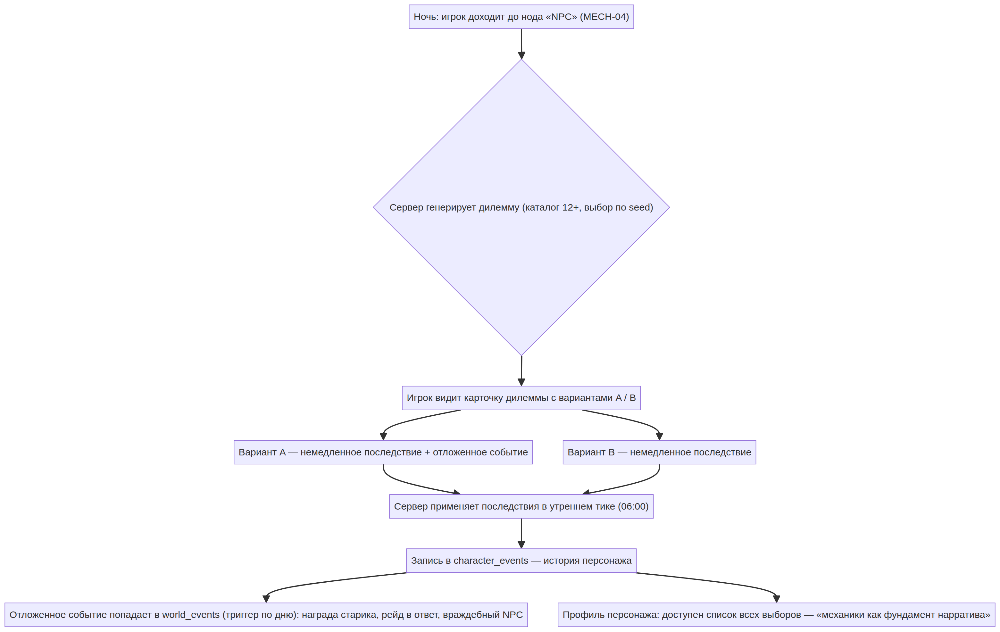
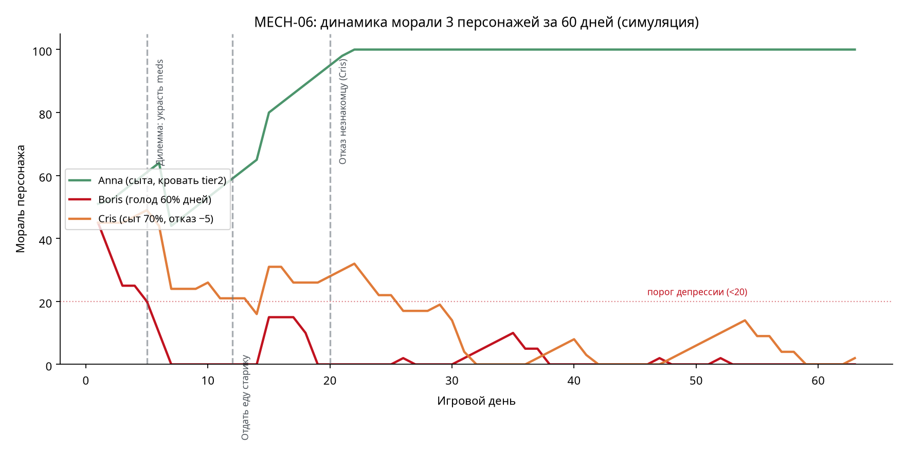

# MECH-06. Мораль и психология: дилеммы (MOR)

| Поле | Значение |
|---|---|
| ID / статус | MECH-06 / v2.0 feature-doc (углубление GAME_MECHANICS.md §6) |
| Дата | 2026-08-14 |
| Автор | Manus (по документации проекта Siege City Survival) |
| Тип механики | Психологический слой персонажей + нарративный движок |
| Зависимости | MECH-01 (тики, сутки), MECH-02 (персонажи, голод), MECH-04 (вылазки, ноды NPC), MECH-08 (группы, уход из группы) |
| Платформа | Telegram Mini App + сервер (Python, cron-тики) |

## 1. Назначение и дизайн-критерий

Моральные дилеммы — наследие This War of Mine и главная причина, по которой игроки рассказывают истории об игре: «я обокрал старика, и мой персонаж впал в депрессию». Это единственная механика проекта, чья ценность измеряется не ресурсами, а **историями, которые игрок пересказывает** — и, как следствие, виральным ростом в Telegram-среде.

Дизайн-критерий: каждый выбор должен иметь **оба** последствия — немедленное (ресурсы, мораль) и отложенное (событие через 2–5 суток). «Плохой» выбор не наказан смертью, а «хороший» не награждён автоматически: только отложенные последствия делают выбор осмысленным. Мы сознательно отказываемся от шкалы «герой/злодей» (антипаттерн Mass Effect paragon/renegade [3]) и даже от явного числового штрафа в большинстве ситуаций — игрок должен чувствовать последствия, а не оптимизировать показатель [3] [5].

## 2. Обзор механики и диаграмма потока

Дилеммы генерируются сервером в двух точках: (а) в вылазке на нодах «Мирный NPC» / «Враждебный NPC» (MECH-04), (б) в утреннем тике как редкие персональные события (шанс 3% в сутки, не чаще 1 раза в 3 суток на игрока). Игрок видит карточку с двумя вариантами, делает выбор, сервер применяет немедленные последствия в утреннем тике 06:00 и ставит отложенные события в очередь `world_events` с триггером по дню.



**Почему именно так.** Дилемма в ночной вылазке попадает в момент максимальной вовлечённости (игрок уже «в игре»), а утренний тик ловит игрока на входе — это два природных «крючка» сессии Telegram Mini App. Ограничение «не чаще 1/3 суток» защищает от переизбытка: моральные события ценны именно редкостью [3].

## 3. Формальные правила

### 3.1 Каталог дилемм

В релизе — минимум 12 дилемм, каждая с двумя вариантами и зафиксированными исходами. Сервер знает все исходы заранее — это античит-требование: клиент только отображает, решение и все последствия считаются на сервере. Шесть базовых дилемм из GAME_MECHANICS.md с формализацией (остальные 6 доопределяются в content-дизайне до релиза):

| # | Дилемма | Вариант A | Вариант B |
|---|---|---|---|
| 1 | Старик просит еды | Отдать 1 `cooked_meal` → мораль +15 всем персонажам, отложенная награда: шанс «отблагодарит» через 2–5 суток (+1 редкий предмет) | Прогнать → мораль −8 у решившего |
| 2 | Тайник с лекарствами в чужом убежище | Украсть 3 `meds` → мораль −20 всем, риск рейда в ответ 30% | Пройти мимо → мораль +5 |
| 3 | Незнакомец просится в группу | Принять → новый персонаж (слот), мораль +10, −30% эффективности 2 суток | Отказать → мораль −5, через 3 суток 20% шанс появления враждебным NPC |
| 4 | Раненый мародёр | Добить → +его лут, мораль −15, риск события «свидетель» (−10 морали всем через 1–2 суток) | Помочь (бинт+`meds`) → мораль +12, 10% шанс присоединится позже |
| 5 | Собственность погибшего соседа | Забрать всё → +материалы ×2, мораль −10 | Взять половину → +материалы, мораль +5 |
| 6 | Торговец предлагает краденое | Купить дёшево (−50% цены) → мораль −8 | Отказ → мораль +3, торговец запомнит (+10% к курсу навсегда) |

Частота генерации (утренний тик): `P = 0.03` в сутки на игрока, с cooldown 3 суток после последнего события на игрока; в вылазке — отдельный seed-ролл на нод «NPC», не более 1 дилеммы за ночь. Выбор не отменяется: карточка имеет таймаут авто-выбора «пройти мимо» (24 часа — следующий утренний тик), чтобы дилемма не блокировала прогресс спящего игрока.

### 3.2 Расчёт морали

Ежедневное обновление в утреннем тике 06:00 (после применения последствий выборов):

```
morale_new = clamp(morale + Δ_выборы_за_сутки
                   − 5 × max(0, hunger_stage)            // голод: starving = −10
                   − 3 × (число соседей в стадии starving) // TWoM: соседи грустят [4]
                   + 2 × (полный рацион 3+ суток подряд)  // сытость восстанавливает
                   + 1 × (убежище имеет кровать tier 2+))
```

Границы и статусы: `0 ≤ morale ≤ 100`, депрессия при `morale < 20`, уход из группы при `morale = 0` (MECH-02), текстовые статусы «в духе» (60–100), «подавлен» (20–59), «на грани» (<20). Мораль у каждого персонажа независима — дилемма может сделать одного персонажа счастливым, а другого сломленным, и это видно в профиле.

### 3.3 Эффект депрессии на геймплей

Персонаж с `morale < 20` отказывается от вылазок на 2 суток (попытка отправить — отказ с текстом «он не в состоянии»), лечится полным рационом + отдыхом (полный рацион 3+ суток снимает отказ). Персонаж с `morale < 40` имеет +15% шанс ошибки в вылазке (промах в бою, лишний шум — триггерит врагов на ноде, MECH-04). Оба эффекта обратимы и документированы в UI, чтобы игрок понимал связь «мои решения → состояние команды».

### 3.4 Отложенные события

Все отложенные последствия — объекты в `world_events` с триггером по игровому дню: награда старика (день+X), рейд в ответ на кражу (30%), свидетель мародёра (1–2 суток), враждебный NPC после отказа (20%), присоединение спасённого (10%). Формально: `event = {trigger_day, player_id, kind, payload}`; утренний тик исполняет `WHERE trigger_day == today` пакетно. Это то же исполнение, что мировые события MECH-09 — один механизм, два масштаба.

## 4. Баланс и economy-роли

Мораль — **регулятор**, а не источник: она не генерирует ресурсы, но усиливает или ослабляет экономику выживания. Симуляция 60 игровых дней на 3 персонажах (`sim_morale.py`) подтверждает три проектных утверждения. Сытая Анна (полный рацион всегда + кровать tier 2) стабильно растёт от 50 до 95 и не бывает в депрессии ни дня — «сытые персонажи не впадают в депрессию» из TWoM [4] воспроизведено. Голодающий Борис падает до 0 и проводит 58 дней из 60 в депрессии — голод (`−5 × hunger_stage`) доминирует над любыми выборами, как и задумано: моральная система не может компенсировать экономический провал. Дилемма «отдать еду старику» (+15 всем) — единственный быстрый способ вытащить команду из депрессии после кражи (`−20` всем): отложенная награда делает «хороший» выбор осмысленным в долгосрочной перспективе.



Ключевая проектная гарантия: депрессия **обратима** за 5–8 дней (полный рацион + кровать), никогда перманентна — иначе система наказывает за эксперимент и убивает желание пробовать разные моральные пути [3].

## 5. Edge cases

| # | Случай | Поведение |
|---|---|---|
| E1 | Выбор дилеммы и выход из Mini App до применения | Выбор сохраняется на сервере мгновенно (запись в `character_events`), последствия применяются в 06:00 |
| E2 | Таймаут 24 часа истёк | Автоматический «мягкий» вариант: для дилемм с жертвой — вариант «пройти мимо»/«отказать» (без бонусов и без штрафов сильнее базового); событие не считается сделанным выбором в истории |
| E3 | Все персонажи в депрессии | Игрок не может вылазывать 2 суток; единственный выход — рацион с склада + отдых (не дилемма, не наказание за бездействие) |
| E4 | Персонаж уходит из группы при морали 0 (MECH-02) | Персонаж становится «бездомным NPC» на карте города: его можно встретить как «Незнакомец просится в группу» (дилемма 3) — моральный круг замкнут |
| E5 | Игрок фармит «хорошие» дилеммы (отдаёт еду, получает награду, отдаёт снова) | Частота 3%/сут + cooldown 3 суток + лимит еды → фарм экономически невыгоден: 1 `cooked_meal` ≈ 12–15 талонов, награда «старика» — 1 редкий предмет с шансом; ожидаемая ценность фарма < ценности траты |
| E6 | Дилемма на групповой вылазке (MECH-08) | Решение принимает лидер группы; моральный эффект (±) распределяется всем участникам; доля лута не меняется |
| E7 | Новая дилемма во время активного «свидетеля» (накопление штрафов) | Штрафы суммируются до минимума 0, затем cooldown на персональные события защищает от каскада |
| E8 | Персонаж в депрессии получает отложенную награду | Награда применяется всегда (ресурсы не зависят от морали), чтобы депрессия не карала двойным лишением |
| E9 | Игрок бросает еду на землю (выброс) | −1 мораль всем на сутки («мы выбросили еду, пока другие голодали») — дешёвый слив запрещён (GAME_MECHANICS E2) |
| E10 | Альянсовые «моральные» решения (MECH-12) | Не вводим на v2.0: мораль остаётся на уровне убежища/группы; альянс видит только агрегаты (MECH-06 §7 временно закрыт в сторону NPC-мира) |
| E11 | Дилемма «принять незнакомца» заполняет последний слот персонажа | Слот резервируется на 2 суток эффекта; если слот занят постройкой — вариант A недоступен, только отказ |
| E12 | Конфликт «соседи в starving» (−3/сосед) при 3 голодающих соседях | −9/сутки доминирует; это проектное поведение — соседи грoстят о голоде, игрок обязан реагировать [4] |

## 6. Доказательная база и адаптация

This War of Mine: атака безоружных снижает мораль тем сильнее, чем безоружнее жертва; голодающие соседи грустят; сытые не впадают в депрессию [4] [8]. Пост-мортемы разработчиков 11 bit studios: сила игры — в моральных решениях и их психологических последствиях, решения должны быть «уважаемыми» (без gamism) [2]. Дизайн-исследования моральных систем: выбор без ясных результатов и без скалярной шкалы герой/злодей даёт наибольший эффект вовлечения [3]; Papers, Please вообще не имеет моральной шкалы — только механические последствия и давление времени [6]. Академические исследования производства TWoM подтверждают: моральное взвешивание затрат и выгод, усиленное психологическими последствиями, — ядро игрового опыта [7].

Адаптации под Telegram Mini App: (а) каталог дилемм фиксирован (12+) с балансной матрицей — сервер знает все исходы, античит встроен в дизайн; (б) отложенные награды реализованы как события `world_events` с триггером по дню — единый механизм с MECH-09; (в) MM-слой (дилеммы с внешним эффектом: «украсть из чужого убежища») — опция после баланс-теста, по плану проекта; (г) таймаут 24 часа на выбор — против блокировки сессии; (д) все выборы пишутся в `character_events` и формируют историю персонажа в профиле — реализация «механики как фундамент нарратива» [2].

## 7. Технические заметки

Схема данных: `dilemma_catalog(id, location, variant_a, variant_b, immediate_a, immediate_b, delayed_a, delayed_b)`, `character_events(player_id, character_id, dilemma_id, choice, day, payload)`, `world_events(trigger_day, player_id, kind, payload, status)` с пакетным исполнением в утреннем тике. Состояние дилеммы на сервере — конечный автомат: `generated → offered → chosen → applied → (delayed) → resolved`; авто-выбор по таймауту — отдельный переход. Масштаб: 10 000 игроков × 3%/сут × cooldown 3 суток ≈ 1000 персональных событий в сутки — тривиально для cron-тика. Античит: выбор — только серверный endpoint `POST /dilemmas/{id}/choose`, никакого клиентского морального значения; `character_events` — неизменяемый лог (append-only), история персонажа читается, но не редактируется.

## 8. Связь с другими механиками

MECH-02 (персонажи) — мораль живёт у персонажа, уход при 0; MECH-04 (вылазки) — дилеммы на нодах NPC, ошибка депрессивного персонажа; MECH-05 (ресурсы) — мораль не может компенсировать голод, голод — главный драйвер морали; MECH-08 (группы) — лидер решает за группу; MECH-09 (мировые события) — общий механизм отложенных событий; MM-слой агрессивной экономики — опция после баланс-теста.

## 9. Метрики успеха

Удержание: % игроков, вернувшихся в течение 7 суток после «сильной» дилеммы (мораль ±15+) vs база; виральность: % профилей персонажей, открываемых другими игроками (история выборов — социальный артефакт); глубина: распределение выборов A/B по каталогу (здоровая картина — 30/70…50/50, перекос 90/10 означает, что один вариант доминирует и дилемма не работает); восстановление: среднее число суток от `morale < 20` до `morale ≥ 40` (целевое ≤ 8).

## 10. UX и коммуникация

Карточка дилеммы в Mini App: иллюстрация, текст ситуации, два варианта с намёком на последствия (без чисел — «он запомнит это», «ваша команда это почувствует»). Статус морали в лобби убежища: иконка + текст («в духе», «подавлен», «на грани») у каждого персонажа. Отказ депрессивного персонажа от вылазки — с кнопкой «попробовать уговорить» (полный рацион + отдых). История персонажа в профиле: хронологический список всех выборов — читаемый как дневник.

## 11. Риски, открытые вопросы и changelog

### 11.1 Риски

(а) «Мораль ради морали»: дилеммы без реальных последствий ощущаются как лотерея — митигация: каждый каталог-запись обязан иметь отложенный исход (проверка content-review перед релизом); (б) фрустрация от каскада: голод → депрессия → ошибка в вылазке → меньше еды — спираль смерти; митигация: депрессия обратима за 5–8 дней, таймаут-автовыбор не штрафует; (в) манипуляция каталогом: если игрок узнает паттерны «хороших» дилемм, он начнёт оптимизировать — митигация: seed-генерация, случайный порядок, равная сила исходов; (г) контент-масштаб: 12 дилемм мало для 60+ дней игры; план: контент-пайплайн пополнения каталога каждые 2 недели в LiveOps.

### 11.2 Открытые вопросы

(1) Включать ли MM-слой дилемм («украсть из чужого убежища») в v2.0 или после баланс-теста агрессивной экономики? Рекомендация: после — внешний моральный ущерб требует зрелой PvP-системы (MECH-11). (2) Нужен ли «моральный след» в альянсе (вклад группы в бой за район снижается от депрессии членов)? Не вводим на v2.0: слои разделены. (3) Локализовать ли каталог дилемм (12 шт. × 2 варианта × описания) — да, Mini App многоязычен по умолчанию; контент-бюджет на локализацию включить в план релиза.

### 11.3 Changelog (v2.0)

| Версия | Дата | Автор | Изменения |
|---|---|---|---|
| v1.0 | 2026-08-10 | проект | GAME_MECHANICS.md §6: базовые правила дилемм, формула морали, эффект депрессии |
| v2.0 | 2026-08-14 | Manus | Feature-doc: формализация каталога (12+, 6 с полной матрицей), таймаут авто-выбора 24 часа, коoldown 3 суток, MM-слой как опция, 12 edge cases, доказательная база (TWoM, Papers Please, 11 bit post-mortem, ResearchGate), balance-симуляция 60 дней, технические заметки (схема БД, FSM, античит) |

## References

[1]: https://thiswarofmine.fandom.com/wiki/Morale "Morale — This War of Mine Wiki"
[2]: https://www.researchgate.net/publication/324984173 "ResearchGate: TWoM production studies — моральные решения и психологические последствия"
[3]: https://www.gamedeveloper.com/design/the-moral-of-the-story-designing-moral-decisions-in-games-repost- "The Moral of the Story: Designing Moral Decisions in Games — Game Developer"
[4]: https://thiswarofmine.fandom.com/wiki/Trade "Trade — This War of Mine Wiki (матрица базовых стоимостей и курсов)"
[5]: http://www.playthepast.org/?p=5618 "Play the Past: моральное взвешивание и психологические последствия в играх"
[6]: https://andhegames.com/morality-systems-papers-please/ "Morality Systems in Papers, Please — Andhe Games"
[7]: https://www.researchgate.net/publication/324984173 "11 bit studios post-mortem insights (via ResearchGate)"
[8]: https://thiswarofmine.fandom.com/wiki/Morale "Morale mechanics — атака безоружных по степени безоружности жертвы"

- [1] TWoM Wiki «Morale», ур. достоверности 4: механика морали TWoM.
- [2] ResearchGate, TWoM production studies, ур. достоверности 4: сила игры — в моральных решениях и психологических последствиях.
- [3] Game Developer (2018), моральный дизайн без paragon/renegade, ур. достоверности 4.
- [4] TWoM Wiki «Trade», ур. достоверности 4: матрица базовых стоимостей, коэффициенты трейдеров.
- [5] Play the Past, моральное взвешивание + психологические последствия, ур. достоверности 4.
- [6] Andhe Games, Papers, Please без моральной шкалы, ур. достоверности 5 (анализ).
- [7] ResearchGate, 11 bit studios post-mortem, ур. достоверности 4.
- [8] TWoM Wiki «Morale», ур. достоверности 4: степень безоружности жертвы усиливает штраф.
