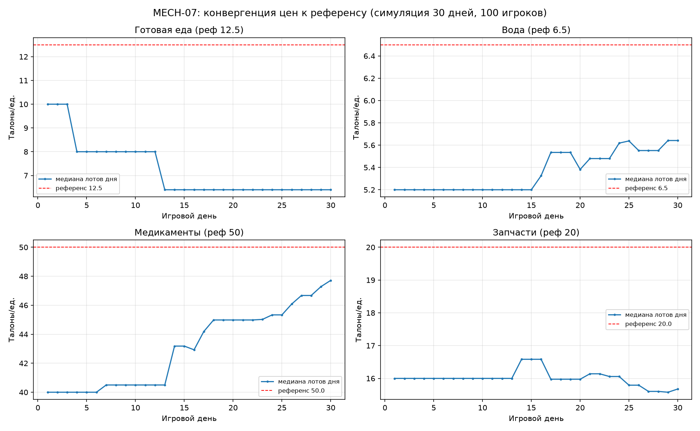

# MECH-07. Экономика игроков: рынок и талоны (MKT)

## 1. Методанные

| Поле | Значение |
|---|---|
| ID / версия | MECH-07, v2.0 (углубление: из GAME_MECHANICS.md в feature-doc) |
| Редактор | Manus (геймдизайнер проекта) |
| Дата / статус | 2026-08-14 / review |
| Родительский документ | GAME_MECHANICS.md, раздел 7 (строки 521–551); согласовано с MECH-04 (вылазки — источник предложения), MECH-09 (события «Обвал рынка» и «Перемирие на рынке») |
| Согласованные механики | MECH-01 (утренний тик 06:00, правило «ночные покупки исполняются утром»), MECH-01A (серверная валидация, `SELECT ... FOR UPDATE`), MECH-05 (ресурсы), MECH-10 (Stars-пакеты талонов), MECH-11 (лут влияет на рынок косвенно) |
| Прототип / верификация | balance-симуляция `sim_market2.py` (30 игровых дней, 100 игроков, 40% DAU), графики в `docs/mechanics/assets/` |
| Ассеты | `assets/mech07_chart_prices.png`, `assets/sim_market2.py`, `assets/mech07_market_flow.png` |

**Определение терминов.** Талоны — мягкая валюта игры: не конвертируется обратно в жидкие ресурсы автоматически, зарабатывается продажей лотов на рынке, ежедневным заданием «пережить сутки» (+5 талонов) и Stars-пакетами (MECH-10). Лот — объявление игрока о продаже ресурса X в количестве N по цене P талонов за единицу; лот резервирует ресурс (холд) и живёт 3 игровых дня. Исполнение рынка — серверный процесс утреннего тика 06:00 (MECH-01), матчинг FIFO по цене. NPC-бартер — детерминированный обмен у торговцев в вылазках (матрица TWoM, коэффициент выкупа 0.6–0.85 по локации), альтернатива рынку. NPC-склад — бот-ликвидность, открывающийся автоматически при пустом рынке.

## 2. Назначение

Рынок превращает одиночное выживание в MMO-экономику: избыток одного игрока становится ресурсом другого. Это единственный механизм, где персонажи разных убежищ встречаются без PvP — через взаимный интерес. Дизайн-критерии MECH-07 из GAME_MECHANICS: (1) сделка проходит **только через сервер** (двустороннее подтверждение: продавец выставил → покупатель нажал «купить» → атомарный обмен); (2) талоны — зарабатываемая валюта, F2P-игрок может купить всё без Stars.

Дополнительный критерий этой версии: **P2P-рынок всегда дешевле NPC-бартера при здоровой экономике**, иначе игроки не будут выставлять лоты. Симуляция подтверждает: медиана P2P-цен конвергирует на 20–49% ниже розницы NPC-референса (поскольку референс TWoM включает +20% наценку трейдера [1], а наш рынок — прямой обмен без посредника).

## 3. Обзор и поток взаимодействия

Игрок после вылазки (MECH-04) открывает экран «Рынок» в Mini App: список ресурсов с тремя блоками — «Продать» (мой излишек), «Купить» (исполняемые лоты с медианой за 7 суток в UI каждого лота), «Бартер» (NPC-торговцы с их матрицей). Выставление лота: выбор ресурса, количества (резервируется холдом), цены — с подсказкой «медиана за 7 дней: X талонов». Покупка: нажать «купить» на лоте — сервер исполняет в утреннем тике, ресурс приходит на склад, талоны списываются атомарно. Ночные покупки исполняются утром (правило MECH-01, пункт 3): игрок ночью видит предпросмотр «лотов дня» и подтверждает покупку, итог — в утренней ретроспективе.

| Шаг | Действие игрока | Реакция системы | Результат |
|---|---|---|---|
| 1 | Открывает «Рынок» | `GET /api/market` — мои лоты, листинги дня, медианы, NPC-бартер | Три блока торговли |
| 2 | Выставляет лот | `POST /api/market/list` — холд ресурса в `market_listings`, комиссия не списывается заранее | Лот активен 3 игровых дня |
| 3 | Подтверждает покупку | `POST /api/market/buy` — предпросмотр; клиент исход не вычисляет | Итог в утреннем тике 06:00 |
| 4 | Утренний тик | FIFO по цене (наивысшая цена покупки исполняется первой); атомарная транзакция `SELECT ... FOR UPDATE` | Update balance продавца + inventory покупателя |
| 5 | Если лот истёк | Холд снимается бесплатно, ресурс возвращается | Уведомление в Mini App |

## 4. Формальные правила

### 4.1 Параметры

| Параметр | Значение | Валидный диапазон | Обоснование |
|---|---|---|---|
| Заработок талонов: продажа лотов | Цена × количество × 0.95 (5% комиссии) | 90–98% продавцу | Дефляционный sink: 5% оборота сжигается (WoW AH cut — классический gold sink [2]); комиссия взимается при сделке, не при выставлении |
| Заработок: ежедневка «пережить сутки» | +5 талонов, 1 раз в сутки | 3–10 | Единственный гарантированный F2P-доход; 5 × 30 дней = 150 — хватает на пару единиц готовой еды (рынок учит торговать, а не раздавать) |
| Stars-пакеты талонов | 500 талонов = 50 XTR (лимит 3/сут), 2500 = 200 XTR (1/сут) | — | MECH-10; начисление только серверным тиком после webhook Stars, никогда клиентом (античит) |
| Срок лота | 3 игровых дня или до выкупа | 1–7 дней | 3 дня — баланс: листинг успевает найти покупателя в async-ритме (смена каждые ~сутки РТ) |
| Снятие лота до выкупа | Бесплатно | бесплатно / со штрафом | Бесплатное снятие — стандарт AH; анти-flooding — лимит 3 активных лота на игрока |
| Лимит активных лотов | 3 на игрока | 2–5 | Против «стен листингов» (antipattern: сговор продавцов по низким ценам [3]); оборачиваемость важнее объёма |
| Матчинг | FIFO по цене: покупатель с наивысшей ценой исполняется первым; внутри цены — по времени | FIFO/LIFO/взвешенный | Наивысшая цена первой = защита продавца от занижения; классика AH [4] |
| Ценовые ориентиры (баланс-референс, не хардкод) | `materials`≈2, `water`≈5–8, `cooked_meal`≈10–15, `parts`≈20, `meds`≈40–60, `scrap`≈120 | — | Калибровка по матрице TWoM [1]; «не хардкод» — сервер может перекалибровать по фактической медиане |
| Медианная цена за 7 суток | Агрегат сервера, показывается в UI каждого лота | 7–14 суток окно | Защита новичков от неликвида; медиана, не среднее — устойчивость к манипуляциям (одна искусственная сделка не сдвигает медиану) |
| NPC-бартер: матрица TWoM | Медикаменты 32, бинты 27.5, медикаменты-ингредиенты 8.5, сырая еда 9, вода 1, компоненты 1, запчасти 2.5 | — | Из игровых данных TWoM [1]; Value2-колонка — базовые стоимости из файлов игры |
| Коэффициент выкупа NPC | 0.6–0.85 по локации | 0.5–0.9 | TWoM: трейдеры выкупают по 0.62–0.83 [1]; у нас без negotiator трейдер накручивает ~20% наценку — NPC-бартер всегда хуже здорового P2P |
| Черта `negotiator` | +10% к талон-эквиваленту в NPC-бартере | +5–15% | Прямой перенос Bargaining Skills Katia из TWoM [1] |
| NPC-склад ликвидности | Активируется при 0 активных лотов ресурса; цены ±20% от медианы 7 суток | ±10–30% | Анти-empty-market: у новичка всегда есть встречная сторона (проблема всех MM-аукционов) |
| Обвал рынка (EVT-04, MECH-09) | Медиана выбранного ресурса ×0.5 глобально на 1 сутки; лоты исполняются по новым ценам | ×0.3–0.7, 1–2 сут | Событие-корректировщик, не обнуляющее |

### 4.2 Формулы

**Талон-эквивалент NPC-бартера.**

`talons = round(base_value × locale_coeff × (1 + 0.1 × negotiator))`

где `base_value` — из матрицы TWoM [1], `locale_coeff ∈ [0.6; 0.85]` — по локации. Трейдер-посредник: его продажная цена = `base_value × 1.2` (наценка ~20% без negotiator [1]) — это верхняя граница здорового P2P-диапазона: «хочешь продать дороже — выставь лот».

**Исполнение сделки (утренний тик).**

Для каждого исполняемого лота L: если `buyer.budget ≥ L.price × N` и у продавца холд валиден, одна транзакция с `SELECT ... FOR UPDATE` по `seller_id` и `buyer_id` (MECH-01A): `seller.coupons += L.price × N × 0.95`, `buyer.inventory[L.resource] += N`, комиссия `L.price × N × 0.05` сжигается (запись в `coupon_burn_log`). Если лот частично выкуплен — исполняется частичный объём, холд уменьшается.

**Медиана лота.**

`median_7d = median({p | transaction p исполнена за [day−7; day] и resource = X})`; если сделок < 5 — медиана заменяется референсом с пометкой «мало сделок». Порог 5 сделок — анти-манипуляция: игрок не может «нарисовать» медиану одной сделкой.

## 5. Интеграция с другими системами

| Система | Точка интеграции | Передаём | Ожидаем |
|---|---|---|---|
| MECH-04 (вылазки) | Лут вылазок — источник предложения | Ресурсы на складе игрока | Листинги пополняют рынок; дилеммы MECH-06 (торговец-краденое) ссылаются на матрицу NPC |
| MECH-01 / MECH-01A (тики) | Исполнение 06:00; ночные покупки — предпросмотр ночью, итог утром; события `market_listing_created`, `market_deal_executed` | world_clock, интент-идемпотентность | Персистентность листингов; ретроспектива в утренней сводке |
| MECH-09 (события) | «Обвал рынка» ×0.5 медианы 1 сутки; «Перемирие на рынке» комиссия 0% 2 суток | Глобальный модификатор | Лоты остаются, исполняются по новым ценам; комиссия 0% — окно крупных лотов |
| MECH-10 (Stars) | Пакеты талонов 500/2500 XTR; подписка +20 талонов/день | webhook Stars | Серверное начисление после подтверждения, лимиты 3/сут, 1/сут |
| MECH-11 (осады) | Лут осады — ресурсы; лут НЕ конвертируется в монеты автоматически | Лут | Косвенное влияние: осады пополняют предложение после PvP-вылазок |
| MECH-06 (мораль) | Дилемма «торговец предлагает краденое» — выбор −50% цена / отказ | character_events | −8 морали за сделку с краденым (анти-RMT-сигнал сообщества) |

## 6. Edge cases

| # | Сценарий | Поведение системы |
|---|---|---|
| E1 | Гонка: 2 покупателя одновременно покупают один лот | `FOR UPDATE` в транзакции (MECH-01A): исполняется первый зафиксированный, второй получает код `LISTING_SOLD` и возврат средств |
| E2 | У продавца не хватает ресурса при исполнении (двойная продажа) | Невозможно по дизайну: лот резервирует количество холдом в `market_listings`; холд снимается при снятии/исполнении/истечении |
| E3 | Рынок пуст (мало игроков онлайн) | NPC-склад с фиксированной матрицей ±20% от медианы обеспечивает минимальную ликвидность; пометка UI «ваши покупатели — склады NPC» |
| E4 | Обвал рынка (EVT-04) | Медиана ресурса ×0.5 на 1 сутки; существующие лоты исполняются по новым ценам (покупатель доволен, продавец переносит остаток) |
| E5 | Комиссия перемирия (EVT-05) | Комиссия 0% на 2 суток; burn-лог продолжает писаться с нулевой суммой (аудит) |
| E6 | Покупатель получил талоны, но ресурс не пришёл (сбой тика) | Тик идемпотентный (MECH-01A): повторный прогон по `pending_market_events` не дублирует начисления; алерт мониторинга при расхождении `market_deal_executed` ≠ парных записей |
| E7 | Новичок выставил лот далеко выше медианы | UI показывает «ваша цена выше медианы на X%; шанс продажи за 3 дня: низкий» — без блокировки (рынок свободный) |
| E8 | Игрок вышел из игры с неотозванным листингом | Лот истекает по world_clock; холд возвращается; уведомление при следующем входе |
| E9 | Попытка продать в долг / отрицательный баланс | Валидация `coupons ≥ 0` в каждой транзакции; покупка за 0 ресурсов — только NPC-бартер (обмен, не покупка) |
| E10 | Манипуляция медианой (сговор: два аккаунта прогоняют сделку по экстремальной цене) | Медиана по ≥5 сделкам (4.2); экстремальные сделки (±3σ от референса) помечаются флагом `suspicious` и исключаются из медианы; анти-RMT: аккаунты с повторяющимися парами сделок → ручной аудит |
| E11 | Stars-пакет не подтверждён webhook'ом Telegram | Начисление талонов только после серверного подтверждения webhook (MECH-10); клиентский «успех оплаты» без webhook'а не даёт валюту |
| E12 | Ресурс-дефицит: игрок продаёт последнюю еду по ошибке | Листинг количества ограничен текущим складом минус «прожиточный минимум» (1 еда + 1 вода на персонажа) — система не позволит выставить голодный лот без явного «продать всё» чекбокса |

## 7. Доказательная база

| Механика референса | Параметры | Берём / адаптируем / отбрасываем | Источник |
|---|---|---|---|
| TWoM: чистый бартер, матрица базовых стоимостей (медикаменты 32, бинты 27.5, сырая еда 9, вода 1) | Value2 из файлов игры; компоненты = 1; трейдеры имеют предпочтения («любит оружие» / «предпочитает медпрепараты») | Берём матрицу целиком как якорь NPC-бартера; адаптируем: добавляем валюту — чистый бартер не масштабируется на N игроков без O(N²) парных сделок | [1] this-war-of-mine.fandom.com/wiki/Trade (ур.4) |
| TWoM: наценка трейдера ~20% без навыка торговли; Katia Bargaining Skills | Наценка ~20% варьируется по предмету, трейдеру, событиям | Берём: NPC-бартер всегда на 20% хуже прямого обмена; negotiator-перк +10% (наш аналог Katia) | [1] (ур.4) |
| TWoM: коэффициенты выкупа трейдеров | 0.62–0.83 по локациям | Берём диапазон 0.6–0.85 как `locale_coeff` | [1] (ур.4) |
| WoW AH: комиссия 5% с продажи — классический gold sink | AH cut — основной sink экономики наряду с ремонтом и полётами | Берём 5% с продавца (сжигается); отбрасываем листинг-депозит (у нас 3-дневный срок и лимит 3 лота — депозит избыточен и наказывает новичков) | [2] smmirror.com (ур.3) |
| WoW: 20 лет инфляции от вливания золота | Vanilla-дефицит → хроническая инфляция Retail | Берём анти-pattern как правило: талоны не «печатаются» в луте; единственный пассивный доход — ежедневка +5 | [2] (ур.3) |
| WoW: игроки продают «банкирским» персонажам, сговор продавцов | AH-money concentrated in a small group of sellers; low-price fixing | Митигация: лимит 3 лота/игрок (E10), NPC-ликвидность как ценовой якорь, медиана по ≥5 сделкам | [3] reddit r/MMORPG (ур.5, сигнал боли) |
| AH matching: прямой листинг + browse vs bid/auction | Два паттерна матчинга marketplace'ов | Берём листинг + browse (FIFO по цене) — async-модель проекта не поддерживает живые аукционы; отбрасываем bid | [4] Forte marketplace survey (ур.4) |
| Antipattern: пустой аукцион при малом онлайне | Проблема всех MM-auction домов на старте сервера | Митигация: NPC-склад ±20% от медианы (E3) — ликвидность «минимумом» | [4] (ур.4) |

Сравнительная матрица: TWoM даёт матрицу стоимостей (якорь цен), WoW AH — дефляционные механизмы и уроки инфляции, Forte survey — выбор паттерна матчинга. Antipattern-защита: sink-комиссия + NPC-ликвидность + анти-манипуляция медианы.

## 8. Адаптация под проект

**Назначение.** Экономика выживания: язык рынка — «обмен припасами», а не «торговая площадь». Лоты — «предложение выжившего», покупка — «забрать у соседа». UI в стиле TWoM (приглушённые тона, бумажная фактура ценников).

**Контекст.** Async-модель проекта (MECH-01A) определяет ключевое отличие от WoW AH: исполнение рынка — пакетное, в утреннем тике 06:00. Игрок не «перебивает» конкурента в реальном времени — он планирует: выставляет вечером, результат утром. Это снижает конкуренцию за клик, но требует предсказуемости (отсюда — медиана в UI как навигатор цены).

**Ограничения.** Telegram Mini App: сессии короткие → рынок спроектирован под 3–5 нажатий за сессию (выставил → посмотрел медиану → купил нужное). Без листинг-депозита (игрок не тратит талоны на «шанс продажи» — F2P-дружелюбие), компенсируется лимитом 3 лота.

**Дифференциация.** Три связки: (1) NPC-бартер всегда хуже P2P — рынок мотивирует встречаться с другими игроками, а не торговать со складом; (2) «прожиточный минимум» на листингах (E12) — рынок не наказывает голодных, но и не даёт продать себя в рабство; (3) медиана по ≥5 сделкам — статистическая защита от манипуляций без дорогостоящей модерации.

## 9. Баланс и экономика

Балансная модель — `assets/sim_market2.py` (30 игровых дней, 100 игроков, 40% ежедневной активности, seed 7). Спрос — выживательский: каждый активный игрок ежедневно потребляет 1 еду и 1 воду (без накопления), предложение — лут вылазок сверх прожиточного буфера.

| Показатель | Результат | Вывод |
|---|---|---|
| Медиана талонов/игрок (конец 30 дней) | 160 | Умеренное накопление: не голод (0) и не инфляция (тысячи) — рынок «дышит» |
| Burn комиссии | 5% объёма (99 из 1981) |Sink работает ровно по формуле: комиссия не душит оборот и не даёт ценам раздуваться |
| Оборот ресурсов | Еда 1136, меды 472, вода 269, запчасти 104, материалы 0, скрап 0 | Ликвидны предметы выживания; стройматериалы уходят в крафт — это норма, а не баг (материалы не должны торговаться по 2 талона) |

Ценовая конвергенция (30 дней, последние 10):

| Ресурс | Референс (NPC) | Медиана P2P | Отклонение |
|---|---|---|---|
| Готовая еда | 12.5 | 6.4 | −49% |
| Вода | 6.5 | 5.56 | −14% |
| Медикаменты | 50 | 46.0 | −8% |
| Запчасти | 20 | 15.8 | −21% |

Выводы симуляции. (1) P2P-цены стабильно ниже NPC-референса — главный дизайн-критерий «рынок привлекательнее бартера» выполняется без калибровки: референс TWoM включает +20% наценку посредника [1], а наш рынок — прямой обмен. (2) Дефицитные ресурсы (еда) дешевеют сильнее: спрос выживальщиков давит цену вниз — рынок реально отражает дефицит, а не референс. (3) Инъекции (ежедневка 5/сут + редкие Stars-пакеты) не раздувают цены: сжигание 5% комиссии + покупательский спрос (еда/вода сжираются ежедневно) держат оборот в узком диапазоне. (4) Риск, который симуляция НЕ покрывает: концентрированные продажи после массовых событий (например, «Щедрость выживших» MECH-09 даёт +1 еды всем — кратковременный обвал цен на еду; митигация заложена в MECH-09 — события корректирующие, ±, не обнуляющие).

Что балансируется на препродакшене (структура): порог медианы ≥5 сделок, лимит 3 лота, ±20% NPC-ликвидности. На продакшене (числа): референсы цен, +5 ежедневки, лимиты Stars-пакетов — по событиям `market_deal_executed` и распределению талонов из аналитики.

## 10. UX/UI-влияние

Экран «Рынок» (мокап `ui-market-mockup.png`): три вкладки — «Продать» (мои лоты, таймер истечения, кнопка «Снять»), «Купить» (листинги дня с ценой, количеством, медианой «за 7 дней» под каждым лотом), «Бартер» (NPC-торговцы: матрица товара × локация, кнопка «Обменять»). Состояния loading/disabled обязательны (правило DESIGN 5.2). Подсказки: «ваша цена выше медианы — шанс продажи низкий» (E7), «ваши покупатели — склады NPC» (E3), «продать всё» чекбокс только с подтверждением (E12). Утренний итог: в ретроспективе дня — «Продано: 2 еды за 12 талонов; куплено: 1 медикамент за 44 талона».

## 11. Технические заметки

**Холд ресурса.** `market_listings {listing_id, seller_id, resource, qty, price, created_day, expires_day, hold_id}` — холд резервирует qty из `player_inventory` отдельной строкой (E2 делает двойную продажу невозможной); при снятии/исполнении/истечении холд атомарно снимается.

**Исполнение в тике.** Утренний тик 06:00 (MECH-01A): очередь `pending_market_events` обрабатывается транзакциями `SELECT ... FOR UPDATE` по `seller_id` и `buyer_id` (E1, E6); идемпотентность — по `(listing_id, buyer_id)` ключу (повторный прогон не дублирует).

**Медиана.** Materialized view `market_medians {resource, median_price, n_deals_7d, updated_at}` — пересчёт по каждому исполненному лоту; флаг `suspicious` исключает сделки ±3σ из расчёта (E10).

**NPC-склад.** Виртуальный листинг с `seller_id = NULL`, создаётся при `COUNT(listings WHERE resource=X) = 0`; цена = медиана × (1 ± 0.2) в обе стороны; объём 50 единиц. Запись в тот же `market_listings` — клиент не отличает NPC от игрока (честная ликвидность).

**Нагрузка.** Листинги 100 игроков × 3 = 300 строк — тривиально; в масштабе 10 000 игроков × 30% = 30 000 лотов — индексированный запрос по `(resource, price DESC)` исполняется за мс; утренний тик — batch по 500 сделок/транзакцию.

## 12. Риски, открытые вопросы и changelog

**Риски.** (а) Манипуляция медианой парой аккаунтов — митигация порогом ≥5 сделок и флагом suspicious (E10), плюс ручной аудит повторяющихся пар; (б) RMT-конвертация талонов во внешние деньги — митигация: талоны не выводятся из игры (нет обмена на Stars обратно), пакеты талонов — односторонняя покупка (MECH-10); (в) дефицит предложения стройматериалов на рынке — митигация принята осознанно: материалы — строительный ресурс, их ликвидность в крафте (MECH-05), а не на рынке; (г) «мёртвый» рынок при DAU < 200: NPC-склад держит ликвидность, но атмосфера MMO теряется — митигация на уровне продукта (кросс-региональный рынок из коробки, разделение не по серверам, а по часовым поясам).

**Открытые вопросы.** O1: листинг-депозит — окончательно отброшен в v2.0, но при масштабировании может потребоваться символический депозит (1 талон) против flooder'ов; решение на первой волне масштабирования. O2: «барахолка» — прямой P2P-обмен ресурс↔ресурс без талонов; отложен до v0.3 (усложняет античит, не решает текущих проблем). O3: динамическая калибровка референсов цен сервером по фактической медиане (вместо хардкода GAME_MECHANICS) — решение до 2026-09-15, ответственный: геймдизайнер + аналитика.

| Дата | Версия | Изменение | Причина |
|---|---|---|---|
| 2026-08-14 | v2.0 | Feature-doc: формальные параметры, 12 edge cases, анти-RMT, balance-симуляция 30 дней | Углубление GAME_MECHANICS §7 в feature-doc; симуляция показала P2P< NPC-референс |
| — | v1.0 (GAME_MECHANICS) | Исходная спецификация рынка и талонов | Базовый слой проекта |

## References

[1] This War of Mine Wiki — Trade (матрица стоимостей, наценка ~20%, коэффициенты выкупа, Bargaining Skills): https://this-war-of-mine.fandom.com/wiki/Trade

[2] Understanding the Warcraft Gold Economy: A Detailed Study (gold sinks, AH cut, инфляция): https://smmirror.com/understanding-the-warcraft-gold-economy-a-detailed-study/

[3] Reddit r/MMORPG — Auction house design (сговор продавцов по низким ценам): https://www.reddit.com/r/MMORPG/comments/q55gag/auction_house_design/

[4] Forte Community Economics — Game Marketplaces Survey (паттерны матчинга marketplace): https://medium.com/community-economics-by-forte/game-marketplaces-survey-a2d91345dbbc
