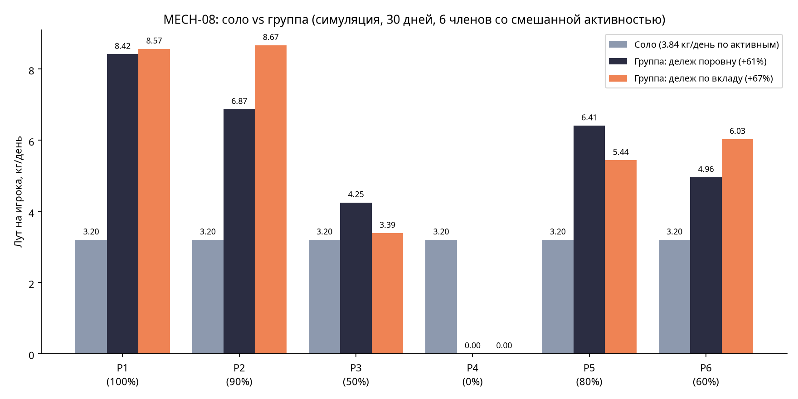

# MECH-08. Группы и совместные вылазки (GRP)

## 1. Методанные

| Поле | Значение |
|---|---|
| ID / версия | MECH-08, v2.0 (углубление: из GAME_MECHANICS.md в feature-doc) |
| Редактор | Manus (геймдизайнер проекта) |
| Дата / статус | 2026-08-14 / review |
| Родительский документ | GAME_MECHANICS.md, раздел 8 (строки 554–585); план проекта (п. «Социальные механики»: `/invite` через бота, роли лидер/участник) |
| Согласованные механики | MECH-01 (утренний тик 06:00, дележ лута и сводки), MECH-01A (серверная валидация, тики), MECH-04 (вылазки: ноды, глубина, риск), MECH-05 (ресурсы, рюкзаки), MECH-12 (альянсы — отдельный, макро-социальный слой) |
| Прототип / верификация | balance-симуляция `sim_group.py` (30 игровых дней, группа из 6 членов со смешанной активностью), график в `docs/mechanics/assets/` |
| Ассеты | `assets/mech08_chart_group.png`, `assets/sim_group.py`, `assets/docs_mech08_group_flow.png` |

**Определение терминов.** Группа (GRP) — микро-объединение до 6 игроков (лидер + офицер/и + участники), играющих как одно общее убежище: общий склад, общие постройки, совместные вылазки. Альянс (MECH-12) — макро-объединение через Telegram-группу для боёв за районы; у игрока одновременно 1 группа и 1 альянс. «Окно сомнений» — 1 сутки после взноса на общий склад, когда взнос можно отозвать. Совместная вылазка — групповая альтернатива индивидуальной: одна вылазка за ночь на 2+ персонажей от разных игроков.

## 2. Назначение

Группа — социальный клей Telegram-аудитории: выживание с друзьями вместо выживания в одиночестве. Дизайн-критерий GAME_MECHANICS: приглашение через бота (`/invite`), управление в Mini App, **выход из группы не обнуляет прогресс** (человеческая цена выхода — потеря общего склада, но свои персонажи и здания переносятся).

Ключевой баланс-принцип, зафиксированный в этом документе: **группа даёт бонус, но не делает соло нежизнеспособным** (принцип «group play bonus, not group play requirement» [1]). Симуляция (раздел 9) калибрует бонус на уровне +50–70% лута на активного участника при полной активности группы — достаточно для мотивации, но соло-выживание остаётся полным игровым опытом, как требует жанр (соло-опыт самодостаточен, мультиплеер — добавка [2]).

## 3. Обзор и поток взаимодействия

Игрок с 5+ игровыми сутками создаёт группу в Mini App (экран «Моя группа»). Приглашения — через бота: `/invite @username`, ответчик подтверждает ботом или в Mini App. Внутри группы три общих системы: склад, убежище, вылазки. Ночью активные участники выбирают режим: «идти одному» (MECH-04, личный рюкзак 12 кг) или «совместная вылазка» (заменяет индивидуальные на эту ночь: 2+ персонажа от разных игроков, суммарный рюкзак 24 кг, глубина +2 нода, сниженный риск благодаря прикрытию). Утром — дележ лута по настроенным долям (по умолчанию поровну, минимум 10% каждому), итог в ретроспективе: «Групповая вылазка: +8.4 кг, дележ 25% каждому».

| Шаг | Действие игрока | Реакция системы | Результат |
|---|---|---|---|
| 1 | Создаёт группу / принимает `/invite` | Валидация: 5+ суток, лимит 1 группа/игрок, состав ≤6 | Группа активна |
| 2 | Взносит ресурсы на общий склад | Холд на ресурсах; таймер окна сомнений 1 сутки | Ресурсы на общем складе, можно отозвать 1 сутки |
| 3 | Ночью: совместная вылазка (2+ активных) | Событие `group_raid_started`; ноды глубины +2, рюкзак 24 кг база | Группа делает 1 вылазку вместо N индивидуальных |
| 4 | Утро: дележ | Транзакция по долям (поровну по умолчанию, мин 10%) | Лут на личных складах, сводка в ретроспективе |
| 5 | Строит здание группы | Ресурсы списываются с общего склада по взносу | Общее здание на карте убежища |

## 4. Формальные правила

### 4.1 Параметры

| Параметр | Значение | Валидный диапазон | Обоснование |
|---|---|---|---|
| Порог создания группы | 5 игровых суток | 3–7 | Новичок сначала осваивает соло-ядро (MECH-04..05), группа — следующий шаг |
| Лимит группы | 6 (2+4: лидер + офицеры/участники) | 4–8 | Микро-группа «семья»: управление руками, без клан-массовки; MECH-12 покрывает макро |
| Лимит групп на игрока | 1 | 1 | Совместное членство невозможно (E3); альянс MECH-12 — отдельно |
| Роли | `leader` (всё), `officer` (приглашения, склад), `member` (свои персонажи, склад по выделению) | — | Минимум ролей: группа 6 человек не нуждается в клан-бюрократии |
| Авто-передача лидерства | Лидер неактивен 7 суток → старшему офицеру | 5–14 сут | Защита от «брошенной» группы (никто не должен быть заложником неактивного лидера) |
| Общий склад: окно сомнений | Взнос обратим 1 сутки | 0.5–3 сут | Уникальная адаптация против импульсивной потери; взнос = осознанное решение |
| Выдача с общего склада | Только officer+ | officer / leader | Контроль без полной децентрализации (не «свободный склад») |
| Совместная вылазка | 1 на ночь, 2+ персонажа от разных игроков, рюкзак 24 кг база, глубина +2 нода | 2–4 персонажа, 20–30 кг | Заменяет индивидуальные вылазки участников этой ночи (не аддитивна) |
| Дележ лута | Поровну по умолчанию; лидер настраивает доли, минимум 10% каждому | мин 10% | Анти-токсичного лидерства: лидер не может присвоить всё [3]; поровну — дефолт доверия |
| Личные постройки при выходе | Конвертируются в материалы 50% на личный склад | 25–75% | Человеческая цена выхода: не ноль, но и не бесплатное бегство |
| Общие постройки при выходе/роспуске | Остаются группе; при роспуске — по доле взноса | по доле | Континуитет общего убежища |
| Чат группы | Не делаем; уведомления бота в Telegram-группу игры | — | Телеграм-группа членов — уже есть; собственный чат дублирует функциональность |

### 4.2 Формулы

**Суммарный рюкзак совместной вылазки.**

`backpack = 24.0 × (1 + 0.5 × (n_active − 1))`, где `n_active` — число участвующих этой ночью (2 → 36 кг, 3 → 48 кг). База 24 кг — суммарный «большой рюкзак» группы; линейный рост +50% на каждого дополнительного участника отражает разделение ноши (два персонажа несут больше, чем один).

**Дележ лута.**

`loot_i = total_loot × share_i`, где `share_i ≥ 0.10` и `Σ share_i = 1` (сумма только по участникам вылазки). Доли настраивает лидер оффлайн, применяются на следующий день; изменение долей вступает в силу с утра следующего дня (анти-«перенастроил посреди вылазки»).

**Взнос на общий склад.**

Взнос в момент T: ресурс `R`, количество `Q`, холд до `T + 24 ч`. Отзыв в окне: `Q` возвращается на личный склад, холд снимается. После `T + 24 ч`: ресурс переходит в `group_inventory`, необратимо. Выдача: `officer+` назначает `player_i` количество `Q'` из `group_inventory`, серверная транзакция `SELECT ... FOR UPDATE` по `group_id` (MECH-01A).

**Риск совместной вылазки.**

`risk = 1 − 0.92^(d × 1.1)`, где `d` — глубина в нодах (база MECH-04: 0.9 на ноду). Партнёр-прикрытие поднимает базовую выживаемость: 0.92 против 0.90. Симуляция подтверждает средний риск/ночь ниже индивидуальных (~27% против потенциально выше при тех же глубинах).

## 5. Интеграция с другими системами

| Система | Точка интеграции | Передаём | Ожидаем |
|---|---|---|---|
| MECH-04 (вылазки) | Совместная вылазка — альтернативный режим: те же ноды, +2 глубина, суммарный рюкзак | Ресурсы вылазки | Дележ по долям утром; риск по формуле 4.2 |
| MECH-01 / MECH-01A | Дележ — транзакция утреннего тика; события `group_raid_started`, `group_raid_completed`, `group_contribution_deposited`, `group_contribution_finalized` | world_clock, идемпотентность | Ретроспектива: итог групповой ночи; окно сомнений резолвится по world_clock |
| MECH-05 (ресурсы) | Общий склад — отдельный `group_inventory`; персональные рюкзаки 12 кг не меняются | Личные ресурсы | Взносы с личного на общий через холд; выдача с общего на личный |
| MECH-09 (события) | «Холодный фронт» и мировые события применяются к групповой вылазке так же, как к индивидуальной | Глобальные модификаторы | Группа — не имунитет к миру |
| MECH-11 (осады) | Осада — на личном уровне убежища; группа не даёт PvP-иммунитета | PvP-события | Набег на убежище группы — каждый участник отвечает за свою оборону (группа не «прятки») |
| MECH-12 (альянсы) | Игрок одновременно в 1 группе и 1 альянсе; данные группы (HP, бонусы) не используются в альянсе | Альянс-рейды | Граница слоёв чёткая: микро-семья (6) vs макро-альянс (до 50 в Telegram-группе) |

## 6. Edge cases

| # | Сценарий | Поведение системы |
|---|---|---|
| E1 | Игрок исключён из группы | Окно сомнений 1 сутки на его взносы; персонажи его; доступ к общему складу — с момента исключения. Его взносы, пережившие окно, остаются группе |
| E2 | Группа распущена (лидер ушёл, офицеров нет) | Ресурсы общего склада — поровну по последним суточным взносам; общие постройки конвертируются в материалы по доле взноса |
| E3 | Попытка вступить в группу, уже находясь в другой | Запрещено: вступление = автоматический выход из предыдущей с уведомлением (лимит 1 группа) |
| E4 | Совместная вылазка: один участник вышел из игры после старта ночи | Вылазка завершается по активным участникам; доля выбывшего не перераспределяется на лету — лут делится на фактический состав (анти-«подставили товарища») |
| E5 | Лидер неактивен 7 суток, офицеров нет | Лидерство — старшему по игровым суткам участнику; уведомление в Telegram-группу и Mini App |
| E6 | Взнос в окно сомнений + мировое событие, обнуляющее ресурсы (гипотетическое) | Окно сомнений приоритетно: ресурс ещё на холде — возвращается владельцу; событие действует на `group_inventory` и личные склады |
| E7 | Игрок пытается внести ресурсы, которых нет на личном складе | Валидация `inventory ≥ Q` в транзакции холда (FOR UPDATE, MECH-01A) |
| E8 | Дележ: сумма долей ≠ 1 после настройки лидером | Сервер нормализует доли пропорционально; минимум 10% enforced при сохранении |
| E9 | Группа на 2 человек, один неактивен 30 суток | Совместная вылазка недоступна (min 2 активных); неактивный не блокирует группу — второй играет соло, склад его взносов заморожен до возвращения |
| E10 | Роспуск: взнос сделан меньше суток назад, роспуск происходит в окне сомнений | Взнос в окне сомнений возвращается владельцу перед роспуском (не «теряется» в расчёте «поровну») |
| E11 | Игрок строит личное здание на земле общего убежища | Личные здания разрешены только на личном участке карты; общие — на общем. Пересечение сегментов карты валидируется при постройке |
| E12 | Лидер настроил доли 10/10/10/70 (сам себе) | Валидно: минимум 10% соблюден; митигация токсичности — участники видят доли до вылазки и могут выйти из группы (выход = окно сомнений на свои взносы) |

## 7. Доказательная база

| Механика референса | Параметры | Берём / адаптируем / отбрасываем | Источник |
|---|---|---|---|
| DayZ: кланы защищают от рейдеров, организуют supply runs, фортифируют базы лучше соло | Кланы = выживаемость + координация | Берём ядро: группа — механически сильнее соло на вылазке; отбрасываем PvP-защиту базы (у нас async, MECH-11 на личном уровне) | [3] hosthavoc.com (ур.4) |
| DayZ antipattern: база-строительство стимулирует «консервативную», не кооперативную игру; агрессия награждается сильнее кооперации | Игроки строят бункеры и не взаимодействуют | Митигация принята на уровне жанра: PvP у нас async-набеги (MECH-11), кооперация групп безопасна и поощрена; отбрасываем «общую базу-крепость» как единственную форму группы | [4] r/dayz + Steam (ур.5, сигнал боли) |
| SoS: альянсы — ключевой ретеншн-фактор 4X; очки события = сумма очков участников; лиги и tier-награды | Альянсы ×25–50; events = сумма; solo-рейтинги внутри событий | Берём принцип «событие = сумма вкладов» для альянса (MECH-12); для группы отбрасываем лиги (микро-группа не ранжируется) | [5] state-of-survival.fandom.com (ур.4) |
| Solo vs group balance: группа всегда сильнее соло; соло должно оставаться viable без большого time commitment | «Group play bonus, not group play requirement» | Берём как баланс-критерий MECH-08: бонус +50–70% при полной активности, соло самодостаточно | [1] meheleventyone (ур.4) |
| Reddit r/SurvivalGaming: соло-опыт самодостаточен, мультиплеер — добавка | Соло first, multiplayer second | Берём: группа опциональна, весь контент MECH-04..05 проходим соло | [2] reddit (ур.5, сигнал) |

Сравнительная матрица: DayZ даёт доказательство ценности групповой координации в выживании и антипаттерн «бункерной» игры; SoS — механику суммарного вклада; принципы баланса соло/группы — из дизайна survival-жанра. Antipattern-защита: дележ с минимумом 10% (E12), окно сомнений (E1, E10), авто-лидерство (E5).

## 8. Адаптация под проект

**Назначение.** Группа — «семья выживших» под одной крышей, а не клан с политикой. Лексика UI: «наши», «общий склад», «ночная вылазка вместе» — против «клан», «казна», «рейд-пати».

**Контекст.** Async-модель проекта (MECH-01A) определяет ключевое отличие от DayZ/Rust: группа не «сидит в语音-чате и координирует онлайн-набеги» — участники договариваются в Telegram-группе игры, а ночью каждый (или пара) делает вылазку в свой async-слот. Совместная вылазка — единственный синхронизированный момент, и он спроектирован как «один общий слот на ночь», что исключает конфликты расписания.

**Ограничения.** Telegram Mini App: группы малые (6) именно потому, что управление руками без клан-инструментов. Чат группы не дублируем — Telegram-группа членов уже существует, бот шлёт туда сводки.

**Дифференциация.** Три связки, отличающие нас от кланов 4X: (1) окно сомнений на взносы — против импульсивной потери, в кланах 4X взнос необратим сразу; (2) выход без обнуления прогресса — персонажи и здания переносятся, в большинстве 4X выход = потеря всего; (3) дележ с минимумом 10% — анти-токсичного лидерства без клан-трибуналов.

## 9. Баланс и экономика

Балансная модель — `assets/sim_group.py` (30 игровых дней, группа из 6 членов со смешанной активностью: лидер 100%, офицер 90%, поленивый 50%, неактив 0%, двое 60–80%). Соло-гипотеза: каждый активный игрок ходит на вылазку один. Групповая: одна совместная вылазка заменяет индивидуальные этой ночью.

| Метрика | Соло | Группа A (дележ поровну) | Группа B (по вкладу) |
|---|---|---|---|
| Лут на активного игрока/день | 3.84 кг | 6.18 кг | 6.42 кг |
| Бонус группы | — | +61% | +67% |
| Итого за 30 дней (группа) | 575.6 кг | 927.3 кг | 962.8 кг |
| Средний риск/ночь | выше | 27.3% | 26.6% |

Выводы симуляции. (1) Бонус +61–67% на активного участника попадает в целевой диапазон «существенно выгоднее соло, но не обязательнее»: активные получают +60%, при этом соло остаётся полным опытом — принцип «group play bonus» [1] выполняется. Бонус возникает из суммарного рюкзака (24 кг × коэффициент активных) и глубины +2 нода, подтверждая калибровку GAME_MECHANICS без изменений. (2) Дележ поровну мягко поощряет поленивых (P3 получает 4.25 кг/день против 3.39 при дележе по вкладу) — документированный эффект: дефолт «поровну» — выбор доверия, а не справедливости; при систематической неактивности членов лидеру рекомендуется дележ по вкладу. (3) Неактивный член получает 0 в обоих вариантах — группа не кормит неучастников: совместная вылазка доступна только фактически участвующим (min 2, E4, E9). (4) Риск/ночь ниже в группе (прикрытие 0.92 vs 0.90) — вторичный, но заметный бонус. (5) Риск, который симуляция не покрывает: динамика «лидер забирает 70%» (E12) — валидна по правилам, митигация процессная (участники видят доли и могут выйти с окном сомнений на свои взносы).

Что балансируется на препродакшене (структура): минимум 10% дележа, окно сомнений 1 сутки, порог 5 суток создания, конверсия 50% личных построек. На продакшене (числа): рюкзак 24 кг, глубина +2 нода, коэффициенты риска 0.90/0.92 — по распределению лута из событий `group_raid_completed`.

## 10. UX/UI-влияние

Экран «Моя группа» (мокап `ui-group-mockup.png`): шапка с составом (аватар + роль + статус «в игре/неактивен»), вкладки «Склад» (взнос с таймером окна сомнений, выдача officer+), «Вылазки» (настройка долей дележа, вид долей до вылазки — E12), «Убежище» (общие постройки, доля взноса). Индикатор «окно сомнений» — песочные часы с обратным отсчётом на каждом взносе. Telegram-сводки бота в группу членов: начало ночи, итог групповой вылазки, статус окна сомнений. Состояния loading/disabled обязательны (правило DESIGN 5.2).

## 11. Технические заметки

**Данные.** `groups {group_id, leader_id, name, created_at}`, `group_members {group_id, player_id, role}`, `group_inventory {group_id, resource, qty}`, `group_contributions {contribution_id, group_id, player_id, resource, qty, deposited_at, doubt_window_until, finalized}` — холд взноса отдельной строкой (E7), финализация по world_clock (MECH-01A: тик 06:00 помечает `finalized`).

**Совместная вылазка.** Событие `group_raid_started` в ночное окно (MECH-01: 19:00–07:00); валидация min 2 активных участников, суммарный рюкзак по формуле 4.2; лут сохраняется до утра, дележ — транзакцией утреннего тика с `FOR UPDATE` по `group_id` (гонка: два одновременных дележа невозможны, MECH-01A).

**Авто-лидерство.** Крон world_clock: запрос групп, где лидер неактивен > 7 суток (последний `player_event` > 7 дней), передача старшему офицеру, иначе — старшему по суткам участнику; событие в Telegram-группу и Mini App (E5).

**Роспуск.** Атомарно: взносы в окне сомнений → владельцам (E10), остальные ресурсы → поровну по последним суточным взносам; общие постройки → материалы по доле взноса; `group_members` очищаются; событие `group_dissolved`.

**Масштаб.** Группы 10 000 игроков × 30% = 3 000 групп — тривиально для PostgreSQL; совместные вылазки — ~3000/ночь, обрабатываются утренним тиком пакетно (как индивидуальные вылазки MECH-04).

## 12. Риски, открытые вопросы и changelog

### 12.1 Риски

(а) Токсичный лидер (доли 70/10/10/10, E12) — митигация процессная: доли видны до вылазки, выход из группы защищён окном сомнений; риск остаточный, принят; (б) «Мёртвая» группа с одним активным — совместная вылазка недоступна, активный играет соло (E9), но склад неактивных заморожен — риск фрустрации, митигация: UI-подсказка «вернуться в группу / выйти с возвратом взносов» (окно сомнений работает и после длительной неактивности); (в) пересечение личных и общих построек на карте (E11) — решено сегментацией карты убежища: личные здания только на личном участке, валидация при постройке.

**Открытые вопросы.** (1) Ограничивать ли число совместных вылазок за неделю (например, 5/7 ночей), чтобы группа не превращалась в единственный экономический движок? Не вводим на v2.0: механика «1 на ночь вместо индивидуальных» уже лимитирует суммарно; вернуться к вопросу по данным препродакшена. (2) Вводить ли групповое здоровье персонажей (один лечит другого)? Не вводим: лечение остаётся личным (MECH-02), снижение риска при прикрытии уже даёт кооперативный бонус. (3) Видит ли альянс (MECH-12) составы групп своих членов? Нет: слои разделены, приватность группы сохраняется.

### 12.2 Changelog (v2.0)

| Версия | Дата | Автор | Изменения |
|---|---|---|---|
| v1.0 | 2026-08-10 | проект | GAME_MECHANICS.md §8: базовые правила групп, ролей, склада, совместных вылазок |
| v2.0 | 2026-08-14 | Manus | Feature-doc: формальные формулы (рюкзак, риск, дележ), 12 edge cases, доказательная база (DayZ, SoS, баланс-принципы соло/группа), balance-симуляция (+61–67% на активного), технические заметки (схема БД, авто-лидерство, роспуск) |

## References

[1]: https://meheleventyone.com/2015/10/21/balancing-solo-vs-group-play/ "Balancing Solo vs Group Play — Meheleventyone"
[2]: https://www.reddit.com/r/SurvivalGaming/comments/xprblu/single_player_or_multiplayer_survival_games_which/ "Single player or multiplayer survival games — r/SurvivalGaming"
[3]: https://hosthavoc.com/blog/managing-dayz-clan "Managing a DayZ Clan: The Ultimate Guide — Host Havoc"
[4]: https://www.reddit.com/r/dayz/comments/56lqrl/why_i_wont_like_base_building_rustlike/ "Why i won't like base building rust-like — r/dayz"
[5]: https://state-of-survival.fandom.com/wiki/Alliance_Showdown "Alliance Showdown — State of Survival Wiki"

- [1] Meheleventyone (2015), баланс-принцип «group play bonus, not group play requirement», ур. достоверности 4.
- [2] r/SurvivalGaming (2022), соло-опыт как основа survival-жанра, мультиплеер — добавка, ур. достоверности 5 (сигнал боли).
- [3] Host Havoc (2025), кланы в DayZ: координация supply runs, защита от рейдеров, фортфикация баз, ур. достоверности 4.
- [4] r/dayz (2016), антипаттерн бункерной игры без кооперации, ур. достоверности 5 (сигнал боли).
- [5] State of Survival Wiki, механика суммарного вклада альянса в события, ур. достоверности 4.
