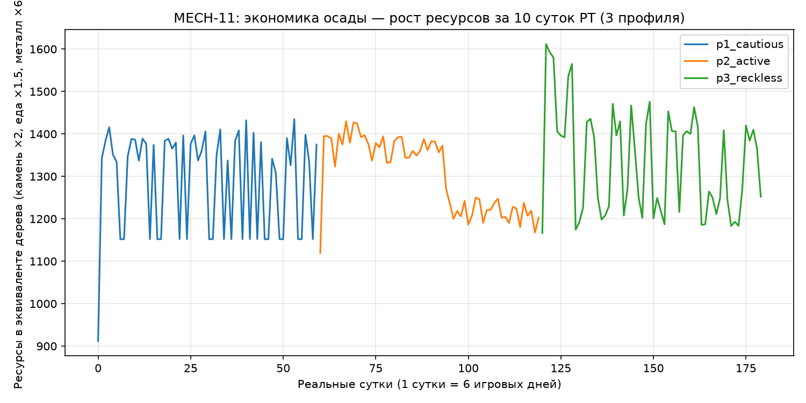
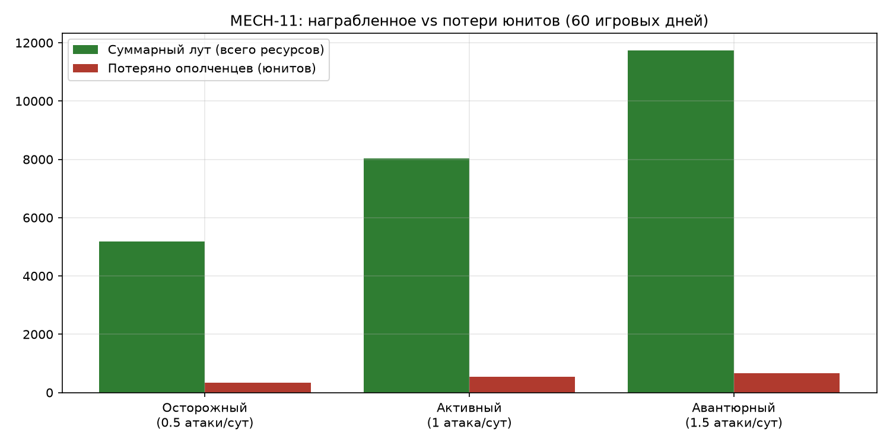

# MECH-11. Async-PvP-осада (набег)

## 1. Методанные

| Поле | Значение |
|---|---|
| ID / версия | MECH-11, v1.0 |
| Редактор | Manus (геймдизайнер проекта) |
| Дата / статус | 2026-08-14 / review |
| Родительский документ | DESIGN-MiniApp-v1.0.0.md, раздел 4.3 «Юниты и осады»; GAME_MECHANICS.md (MECH-01A — сетевой протокол) |
| Согласованные механики | MECH-01 (сутки и тики), MECH-01A (сетевой протокол), MECH-03 (город/здания), MECH-05 (ресурсы), MECH-07 (рынок — лут влияет на рынок косвенно), MECH-12 (альянс-бонус атаки) |
| Прототип / верификация | balance-симуляция `sim_siege.py` (60 игровых дней, 3 игровых профиля), CSV-данные и графики в `docs/mechanics/` |
| Ассеты | `assets/mech11_siege_flow.png`, `assets/mech11_siege_states.png`, `assets/mech11_chart_resources.png`, `assets/mech11_chart_loot_vs_losses.png`, `assets/sim_siege.py` |

**Определение терминов.** Async-PvP-осада (набег) — асинхронный бой, в котором атакующий игрок выбирает цель и отправляет состав ополченцев, сервер рассчитывает исход боя против снимка (snapshot) реально построенного города цели в момент атаки, и атакующий получает результат через 3–60 минут, находясь вне игры. Ополченец — единственный тип юнита в MVP (сила юнита `u_militia = 12`, стоимость набора — по таблице MECH-05/календаря набора казарм). Жидкие ресурсы — ресурсы, накопленные в хранилищах и коллекторах сверх гарантийных минимумов (поддаются краже); гарантированный минимум — 10% ёмкости каждого хранилища, который нельзя украсть (CoC-практика лоут-капов, см. раздел 7).

## 2. Назначение

Механика создаёт эстетику **Competition** (триумф успешного набега, реванш после набега на свой город) и усиливает **Fellowship** (альянс-бонус атаки и совместный бой за район — MECH-12) через динамику дефицитного риска: игрок ставит часть ополчения под потери 40–70% ради лута, который ускоряет рост города.

**Дизайн-критерий.** Механика успешна, если к третьей неделе игры средний активный игрок выполняет ≥1 атаку в сутки и ≥1 раз отправляет скриншот репорта боя («отбили набег» / «зачистили базу») в чат альянса. Верификация: событийная аналитика `siege_attack_started` и опрос в Telegram-канале проекта на 21-й день закрытого теста.

## 3. Обзор и поток взаимодействия

Игрок открывает экран «Осада» (таб «Ополчение» → кнопка «ОСАДА»), выбирает из списка сканера до 20 подходящих баз и видит по каждой: ориентировочный лут по четырём ресурсам, примерную мощь защиты и наличие щита. Он сдвигает ползунок состава (до 100% ополчения, но сервер блокирует выбор >90% — 2 минимальных юнита должны остаться в лагере) и нажимает MainButton «НАЧАТЬ НАБЕГ» с нативным диалогом `ClosingConfirmation` («Отправить N ополченцев в набег? Потери составят 40–70%»). Атака уходит в асинхронный расчёт: результат приходит через 3–60 минут (фиксированная задержка по «расстоянию» между базами), бот присылает уведомление, а уцелевшие возвращаются в лагерь репортом «N ополченцев вернулось из похода».

Формальный поток:

| Шаг | Действие игрока | Реакция системы | Результат |
|---|---|---|---|
| 1 | Открывает экран «Осада» | `GET /api/siege/scanner` — список до 20 целей, каждая с луп-превью и меткой щита | Список целей, отфильтрованный по матчингу (раздел 4.2) |
| 2 | Выбирает цель и двигает ползунок состава | Клиент пересчитывает предпросмотр: ожидаемые потери 40–70% составов, ожидаемый лут | Видимый до атаки лут (CoC-практика прозрачности) |
| 3 | Нажимает «НАЧАТЬ НАБЕГ» | `POST /api/siege/start` — сервер в транзакции: создаёт snapshot базы цели, замораживает состав, списывает стоимость поиска (5 монет) | Сессия осады `status=queued`, `resolved_at` = now + задержка |
| 4 | Ждёт (может закрыть Mini App) | Сервер выполняет расчёт в окне результата; бот шлёт уведомление с deep link `screen=siege_result&siege_id=…` | Уведомление через 3–60 мин по расстоянию |
| 5 | Открывает результат | `GET /api/siege/{id}/report` — репорт боя: ход боя (что разрушено), лут, потери, награда опыта | Лут зачислен; уцелевшие вернулись; цель получает щит при ≥30% разрушения |

Тайминг «расстояния» фиксирован, а не реальный: расстояние в «клетках» между базами (0–57 по сетке 6×8×3-зоны) маппится на задержку 3–60 минут линейной шкалой (3 + 57/57×57 мин), чтобы окно результата оставалось предсказуемым и управляемым для дизайнера.

## 4. Формальные правила

### 4.1 Параметры

| Параметр | Значение | Валидный диапазон | Обоснование |
|---|---|---|---|
| Мощь юнита ополчения `u_militia` | 12 | 8–20 | Калибровано под казармы Ур.1 = 20 юнитов → базовая армия 240 (см. 4.3, симуляция) |
| Гарнизон = ополчение цели | 100% состава в лагере | 50–100% | Цель не тратит время на «размещение»; упрощение async-боя (Edgeworld: без размещения) |
| Бонус стен по HQ-уровню | Ур.1: ×1.0, Ур.2: ×1.15, Ур.3: ×1.30 | ×1.0–1.5 до Ур.5 | HQ-гейт аналог Town Hall; стены как множитель защиты — перенос CoC «стены определяют тир базы» |
| Порог победы | мощь_атаки ≥ 1.15 × мощь_защиты | 1.1–1.25 | Буфер 15% даёт защиту: 51% симметричных дуэлей — ничьи/перегруппировка, а не рандом (antipattern Builder Base — высокий рандом фрустрирует) |
| Лут — доля жидких ресурсов | 20% | 10–30% | Фиксировано DESIGN 4.3 («до 20% ресурсов нарушителя»); доля ниже CoC-коллекторов (50%), чтобы осада не была главным фармом |
| Гарантированный минимум цели | 10% ёмкости каждого хранилища | 5–15% | CoC-лоут-капы: у цели всегда остаётся «старт на завтра» — анти-выгорание жертвы |
| Потери атакующего (победа) | 40–55% отправленного состава | 30–60% | DESIGN 4.3 «потери 40–70%»: победа берёт нижнюю границу (урок Edgeworld — возврат уцелевших) |
| Потери атакующего (поражение) | 55–70% | 50–80% | Поражение наказывает, но не обнуляет армию — ключевая дифференциация от CoC |
| Ограничение выбора состава | ≤90% ополчения, минимум 5 юнитов в атаке | 3–90% | Всегда 2 юнита в лагере — защита от «голой базы» при рейде (edge case E8) |
| Лимит атак в сутки | 3 | 2–5 | Трикольцевая структура (ежедневная осада — Tier 3); анти-spam и сохранение ценности каждой атаки |
| Стоимость поиска цели | 5 монет | 1–20 монет | CoC-стоимость поиска матча; монеты — мягкая валюта, не pay-to-win |
| Щит новичка | 3 дня игры + 12 ч после любой завершённой защиты | 2–4 дня | DESIGN 4.3; защита оффлайн-новичков от первых негативных впечатлений |
| Щит за ≥30% разрушения | 12 ч | 8–16 ч | CoC: 30% → 12 ч щита; в проекте верхняя планка упрощена до одного уровня |
| Village Guard после щита | 30 мин | 15–60 мин | CoC guard: атаки не тратят guard; буфер «дойти до Telegram после пуша» |
| Штраф атаки под щитом | −3 ч за 1-ю атаку, −4 ч за 2-ю, далее до −24 ч | прогрессия ×1.3 | CoC-серия 3→4→5→…→24; защита «турбо-PvP-надзора» |
| Задержка результата | 3–60 мин по расстоянию | 2–60 мин | DESIGN 4.3; окно удержания между Tier-сессиями |

### 4.2 Матчинг целей (сканер)

Сканер возвращает до 20 целей из пула: игроки с истёкшим щитом новичка, не под активным щитом 12 ч, игравшие в последние 24 часа (офлайн-игроки не наказываются — правило MECH-09 «набеги мародёров»). Приоритетный ранг цели:

`rank = |мощь_атаки(предпросмотр) − мощь_защиты(цели)| / мощь_защиты(цели)`, сканер предпочитает цели с рангом ≤0.5 (симметричные и чуть слабее) с шумом ±10%, чтобы новичок не натыкался на «китов». Игрок может вручную выбрать цель с рангом >0.5 — запретов нет, но клиент показывает предупреждение «Цель сильнее вас на X%».

Матчинг учитывает уровень HQ: разрыв ≤1 уровня HQ по умолчанию; игрок с включённым тоглом «Искать сильнее» снимает это ограничение.

### 4.3 Формулы

**Мощь атаки.**

`P_atk = Σ(u_i × s_i) × B_alliance`

где `u_i` — количество юнитов типа i, `s_i` — сила (ополчение: 12), `B_alliance` — бонус альянса (1.0 без альянса; 1.05–1.15 по уровню альянс-прогрессии, MECH-12). Пример: атакующий отправляет 18 ополченцев с альянсом Ур.3 (бонус 1.10): `P_atk = 18 × 12 × 1.10 = 237.6`.

**Мощь защиты.**

`P_def = Σ(u_j × s_j) × W_hq`

где сумма — ополчение цели в лагере, `W_hq` — множитель стен HQ (4.1). Пример: цель Ур.2 HQ, 16 ополченцев в лагере: `P_def = 16 × 12 × 1.15 = 220.8`. Победа атакующего: 237.6 ≥ 1.15 × 220.8 = 253.9 — нет, поражение (дефицит 6%). Клиенту атакующего показывается индикатор «Цель чуть сильнее».

**Лут.**

`loot_r = 0.20 × max(0, R_r − 0.10 × cap_r)`

где `R_r` — жидкий ресурс r в хранилищах и коллекторах цели в момент snapshot, `cap_r` — ёмкость хранилища r. Лут выдаётся в ресурсах (не в монетах), по всем четырём типам пропорционально доле каждого в жидкой массе. Пример: у цели 400 дерева (кеп 480): `loot_wood = 0.20 × (400 − 48) = 70.4 → 70`.

**Потери состава.**

`loss_rate = L_min + (L_max − L_min) × max(0, 1 − P_atk / (1.15 × P_def))`

где `L_min = 0.40`, `L_max = 0.70` (победа: верхняя граница 0.55, поражение: 0.70). Потери минимальны при решительной победе и максимальны при тяжёлом поражении — это убирает детерминизм «всё или ничего» CoC. Пример победы с P_atk = 237.6, P_def = 220.8: `loss_rate = 0.40 + 0.15 × (1 − 237.6/253.9) = 0.40 + 0.15 × 0.064 = 0.4096 → 41%`, из 18 юнитов теряется 7, возвращается 11.

**Щит от разрушения.** Щит 12 ч выдаётся при достижении ≥30% разрушения зданий цели (разрушение = урон атаки, распределённый по зданиям пропорционально их HP; HQ неразрушаем). Атаки под щитом тратят щит по прогрессии 3→4→5→6→8→10→12→16→20→24 ч (CoC).

**Опыт.** Опыт за атаку: базово 25 × (доля разрушения цели), победа +30 бонус, поражение +10 утешительный. Опыт не привязан к луту — анти-P2W и анти-гринд.

### 4.4 Состояния осады и базы

Состояния сессии осады: `queued → computing → resolved → reported`. Переход `queued → computing` — по `resolved_at`; сервер фиксирует `computed_at` и не перечитывает изменяющиеся состояния цели (snapshot изолирует бой). Состояния защиты базы игрока: `newbie_shield → vulnerable → attacked(в окне расчёта) → shielded_12h → guard → vulnerable` (цикл). Переходы только по порогам и таймерам из 4.1; переходов по клиентским событиям нет — сервер единственный владелец состояний (MECH-01A).

### 4.5 Тайминги

| Событие | Значение |
|---|---|
| Окно результата | 3–60 мин по расстоянию (4.3, задержка фиксированная) |
| Уведомление бота о результате | мгновенно после `resolved`, deep link `screen=siege_result` |
| Щит после защиты | 12 ч, guard 30 мин следом |
| Щит новичка | 3 дня + 12 ч после защиты |
| Штраф атаки под щитом | −3 ч за атаку, прогрессия до −24 ч |
| TTL snapshot незавершённой осады | 24 ч (после — отмена, юниты возвращены без потерь, компенсация стоимости поиска) |
| Кулдаун повтора атаки на ту же цель | 24 ч (revenge-окно: жертва может ответить в 12 ч) |
| Revenge-атака | жертва в 12 ч после набега может атаковать налётчика с +20% к мощи атаки |

## 5. Интеграция с другими системами

| Система | Точка интеграции | Передаём | Ожидаем |
|---|---|---|---|
| MECH-01 / MECH-01A (тики и протокол) | События осады — в интенты суточного тика 05:00; polling-клиент через `GET /api/siege/{id}/report` | siege-события в `pending_player_events` | Ретроспектива оффлайн-цели (репорт «на вас совершили набег») |
| MECH-03 (город/здания) | Snapshot базы при `start`; стены по HQ-уровню; разрушение зданий в репорте | ID базы цели | Серийализованный снимок зданий (HP, уровень) |
| MECH-05 (ресурсы) | Жидкие ресурсы цели по формуле 4.3; лут зачисляется на счёт атакующего | Балансы 4 ресурсов | Атомарное списание лута из хранилищ цели (SELECT FOR UPDATE) |
| MECH-07 (рынок) | Лут влияет на предложение ресурсов косвенно; рынок не модифицируется — лут не конвертируется в монеты автоматически | — | — |
| MECH-12 (альянсы) | `B_alliance` в формуле мощи атаки; альянс-рейд — суммарный урон по району | ID альянса, уровень прогрессии | Бонус 1.05–1.15; счётчик урона реяда |
| Экономика монет | Стоимость поиска 5 монет | ID игрока | Списание/отказ при недостатке |
| Уведомления (бот-слой DESIGN 4.5) | Результат осады, revenge-инвайт, щит | siege_id, outcome, loot | Сообщение с inline deep link, квота 30 msg/s |
| Античит / валидация | Всё: сервер считает бой, клиент только предпросмотр | snapshot + состав | Невозможность клиентского подлога исхода |
| Прогрессия / задания | Ежедневный квест «соверши 1 набег»; сезонный пропуск «Осада: сезон 1» (+15% опыт осады) | siege-события | Зачёт заданий, косметика флагов |

## 6. Edge cases

| # | Сценарий | Поведение системы |
|---|---|---|
| E1 | Игрок закрыл Mini App до получения результата | Сессия живёт на сервере; polling возвращает статус `resolved`; бот присылает уведомление с deep link; юниты возвращены автоматически |
| E2 | Интернет пропал в момент `POST /api/siege/start` | Интент идемпотентен по `client_request_id` (MECH-01A); повторный запрос возвращает созданную сессию, двойного списания нет |
| E3 | Цель изменила состав ополчения после snapshot | Расчёт идёт по snapshot; реальные изменения после `start` не влияют; клиенту цели это не видно до репорта — осознанное решение (async-модель) |
| E4 | Игрок был целью набега оффлайн | Утренний тик 05:00 / вход в Mini App: ретроспектива из `pending_player_events` — «Мародёры обчистили ваш город: −N ресурсов, разрушено X%»; щит 12 ч выдан автоматически при ≥30% разрушения |
| E5 | Две атаки на одну цель в одном окне расчёта | Snapshot блокирует повторный `start` на ту же цель до `resolved`; вторая попытка → код `TARGET_BUSY` с предложением другой цели |
| E6 | Цель вышла из игры навсегда (неактив >30 дней) | Исключается из сканера (правило 24 ч активности); её база не может быть атакована — защита «мёртвых деревень» |
| E7 | Атакующий покинул альянс в окне расчёта | `B_alliance` фиксируется в snapshot атаки на `start`; покинутый альянс не пересчитывается |
| E8 | У игрока 1 ополченец и на него нападают | Минимальный гарнизон не защищён — 1 юнит vs армия: город разрушается ≥30%, щит выдаётся; набор новых юнитов через казармы по обычным правилам (еда-блокировка MECH-03) |
| E9 | Игрок атакует под своим щитом | Штраф −3/−4/… ч к оставшемуся щиту; если щит <3 ч — атака блокируется с кодом `SHIELD_TOO_SHORT` и подсказкой |
| E10 | Реванш: жертва атакует налётчика в 12-часовом revenge-окне | Revenge-сессия создаётся с +20% к мощи атаки и без стоимости поиска; по истечении 12 ч окно закрывается (`REVENGE_EXPIRED`) |
| E11 | Сервер упал в середине `computing` | Сессия пересчитывается при поднятии; snapshot persisted; игрок получает результат после восстановления, никаких потерь сверх формулы |
| E12 | Коллизия: игрок одновременно набирает ополчение и его состав в атаке | Состав в атаке заморожен; набор новых юнитов не влияет на сессию; клиент показывает «N юнитов в походе» как отдельные счётчики лагеря |

## 7. Доказательная база

| Механика референса | Параметры | Берём / адаптируем / отбрасываем | Источник |
|---|---|---|---|
| CoC Multiplayer Battles: лоут из коллекторов до 50%, cap по TH, лоут виден до атаки | cap TH13+ = 80 000 ±20 000; доля по уровню TH | Берём прозрачность лоута до атаки; адаптируем cap в 10% гарантийного минимума + 20% долю (наша экономика мягче); отбрасываем TH-прогрессию долей | clashofclans.fandom.com (ур.4); clash.ninja (ур.4) |
| CoC Shields: 30/60/90% разрушения → 12/14/16 ч; Village Guard; Personal Break; штраф атаки под щитом 3→24 ч | 30%→12ч, 60%→14ч, 90%→16ч; guard 30 мин–4 ч | Берём 30%→12ч и прогрессию штрафа; адаптируем guard в 30 мин (короче сессии Telegram); отбрасываем Personal Break (нет смысла в always-accessible TMA) | Supercell Dev's Desk I/II (ур.2); clash.ninja (ур.4) |
| Kabam Edgeworld: async-PvP с возвратом войск, неинтерактивный бой | Бой: выбор цели → инициация → расчёт; критика «brutally uneventful» | Берём возврат войск (DESIGN 4.3); не повторяем ошибку — у нас читаемый репорт боя с ходом и % разрушения; отбрасываем warp-gates (3 ворота с перезарядкой) | gamedeveloper.com post-mortem (ур.2) |
| Last Day on Earth: вход в PvP через квест-гейт и окно 8 ч | Уровень 150; 5 заданий-квестов; окно 8 ч | Адаптируем как «квалификацию»: первые 3 дня = щит новичка + туториал-набег ИИ-грабителей (DESIGN 5.1 онбординг); отбрасываем шум-метр (мобильный survival, не наш контекст) | LDoE Wiki (ур.4) |
| State of Survival: альянс-рейды — суммарный урон, лидерборд | Рейды по боссу/району | Переносим в MECH-12 (бой за район); для MECH-11 используем только альянс-бонус `B_alliance` | DESIGN 4.4 [9] |
| Antipattern: Builder Base CoC 2024 — рандомный power-модификатор, награда только за победу | Рандом ± большой дисперсии | Отбрасываем: наш порог победы 1.15 и формула потерь 4.3 дают детерминированный, читаемый исход; награда и за поражение (опыт +10) | Reddit r/ClashOfClans 2024 (ур.5, сигнал боли) |
| Antipattern: CoC-потребление 100% войск при проигрыше | Потеря всех войск | Отбрасываем: DESIGN 4.3 жёстко фиксирует возврат уцелевших (урок Edgeworld) — наша главная дифференциация для удержания новичков | DESIGN 4.3 [8]; Edgeworld (ур.2) |

Сравнительная матрица: по «защите жертвы» лидирует CoC (многоуровневые щиты) — берём её модель, упрощая до 2 уровней (щит 12 ч + guard 30 мин); по «защите атакующего» лидирует Edgeworld (возврат войск) — берём; по «социальному слою» лидирует SoS (альянс-рейды) — переносим в MECH-12.

## 8. Адаптация под проект

**Назначение.** Competition сохраняется как в CoC, но тон переопределён под фэнтези проекта: не «клановая война за трофеи», а «выживание среди мародёров» — язык уведомлений («Мародёры обчистили ваш город») и реванш-механика делают PvP частью нарратива осадного города, а не отдельным режимом.

**Контекст.** В отличие от CoC у нас нет размещения войск на карте 6×8 (async-бой без фазы деплоя — прямое следование Edgeworld и упрощение для TMA-аудитории). В отличие от LDoE нет инстансов рейда — одна формула на всех, единая экономика MECH-05.

**Ограничения.** Telegram-платформа: сессия ≤5 минут (Tier 1), бои считаются сервером (клиент не получает ни одного байта «боевой логики» — античит по дизайну), окно результата 3–60 мин заменяет push-уведомления CoC — бесплатные через Bot API.

**Дифференциация.** Три уникальных связки: (1) реванш-окно 12 ч с +20% бонусом — превращает каждый набег в мини-историю «месть»; (2) щит «после защиты» 12 ч — жертва получает передышку не только при поражении, но и при любой защите, что снижает фрустрацию «меня фармят»; (3) формула потерь с минимумом 40% даже при решительной победе — риск всегда реален, осада не становится бесплатным фармом.

## 9. Баланс и экономика

Балансная модель — `assets/sim_siege.py` (60 игровых дней ≈ 10 суток РТ, конфигурация согласована с balance_sim.py из GAME_MECHANICS: 4 ресурса, дерево как базовая единица, камень ×2, еда ×1.5, металл ×6 в стоимостном эквиваленте). Три игровых профиля:

| Профиль | Частота атак | Профиль целей | Атак | Потери юнитов | Рейдов по базе | Суммарный лут |
|---|---|---|---|---|---|---|
| Осторожный | 0.5/сут | слабее себя, редкие рейды | 38 | 338 | 0 | 5 174 |
| Активный | 1/сут | равные, рейды по расписанию | 60 | 545 | 26 | 8 032 |
| Авантюрный | 1.5/сут | сильнее себя, частые рейды | 88 | 668 | 51 | 11 740 |

Выводы симуляции. (1) Агрессивная стратегия даёт ×2.3 лута против осторожной, но потери юнитов растут почти линейно (338 → 668), а частые рейды съедают до 90% жидких ресурсов за удар — база восстанавливается кепом и производством за ~2 игровых дня, что подтверждает правило «рейды не убивают прогресс, а лишь замедляют». (2) ROI атаки по времени: средняя атака стоит ~5 мин игры + 5 монет, приносит ~134 единицы лута (активный профиль) — экономически атака всегда выгоднее простоя коллекторов, но ограничена лимитом 3/сут. (3) Риск-кривая формулы потерь (4.3) даёт ожидаемые потери 45–50% при симметричных дуэлях — попадает в диапазон DESIGN 4.3 «40–70%».

Что балансируется на препродакшене (структура): пороги победы 1.15, доля лута 20%, прогрессия штрафа щита. Что балансируется на продакшене (числа): сила ополчения 12, множители стен, бонус альянса — по событиям `siege_attack_started`/`siege_resolved` из аналитики.

## 10. UX/UI-влияние

Экран «Осада» (мокап `ui-siege-mockup.png`): сверху — список сканера (20 карточек: миникарта базы, лут-превью по 4 ресурсам, значок щита, индикатор силы «слабее/равно/сильнее»); по тапу — детальный предпросмотр с ползунком состава и расчётом ожидаемых потерь. MainButton «НАЧАТЬ НАБЕГ» с `ClosingConfirmation`. Состояния loading/disabled обязательны против двойного тапа (TMA-правило DESIGN 5.2).

Экран результата: репорт боя с «ходом боя» — 4–6 строк («ополчение прорвало первую линию», «разрушено: лесопилка Ур.2, казармы Ур.1», «забрано: 70 дерева, 35 камня…», «вернулось 11 из 18»), награда опыта, кнопка «Ответить» (revenge, если в 12-часовом окне). HUD города: иконка щита на фасаде HQ с таймером. Уведомления бота: три шаблона — «Ваш набег завершён», «На ваш город совершили набег», «Вы можете ответить налётчику (осталось N ч)».

## 11. Технические заметки

**Обязательная серверная валидация (античит-граница).** `POST /api/siege/start`: транзакция с `SELECT ... FOR UPDATE` по ресурсам цели (MECH-07-паттерн атомарности), снимок мира по `world_clock` MECH-01A, проверка фаз (атака возможна в любой фазе — PvP не привязан к циклу суток, но результат всегда резолвится до 05:00 ближайшего тика, чтобы оффлайн-игрок увидел итог в утренней ретроспективе). Клиент получает только предпросмотр — исход боя клиент не вычисляет и не подтверждает.

**Персистентность.** Snapshot базы и состав атаки — отдельные таблицы `siege_snapshots`, статусная машина в `siege_sessions`; при падении сервера `computing` пересчитывается (E11). Репорты и revenge-окна — в `pending_player_events`.

**Нагрузка.** Пик: ~3 атаки/сут × N активных игроков; атаки размазаны по окну 3–60 мин, серверная обработка — пачками по cron-тик (MECH-01A, 10 000 игроков ≤300 с на тик). Резолвинг осады — O(1) по формулам 4.3, без итераций.

**Реализация расстояния.** «Расстояние» — не физика, а хеш `(attacker_id, target_id, day) mod 57`, детерминированный на сутки: игрок видит «дальнюю цель — результат через 50 минут» ещё на предпросмотре, расхождения клиента и сервера исключены.

## 12. Риски, открытые вопросы и changelog

**Риски.** (а) Фарм новичков опытными игроками сразу после истечения 3 дней — митигация: сканер-матчинг по HQ (разрыв ≤1) + постепенное «выпускание» из щита (мягкий режим: щит новичка 5 дней для топ-5% по ресурсам). (б) Агрессивные игроки выносят 20% лута у целей чаще, чем те успевают восстановить — митигация: гарантированный минимум 10% + лимит 3 атаки/сут + рейды восстанавливаются за ~2 дня (подтверждено симуляцией). (в) Реванш-окно превращается в цикл бесконечной мести — митигация: 1 revenge на пару за 24 ч, без стоимости поиска, с +20% бонусом (решает конфликт быстро). (г) Рандомность задержки 3–60 мин воспринимается как лаг — митигация: детерминированный хеш расстояния + явный таймер в UI репорта.

**Открытые вопросы.** O1: значение силы ополчения (12) при появлении юнита «ветеран» в v0.2 — решение до 2026-09-01, ответственный: геймдизайнер. O2: коэффициент бонуса альянса (1.05–1.15) после первого сезона MECH-12 — решение до 2026-09-15, ответственный: геймдизайнер.

| Дата | Версия | Изменение | Причина |
|---|---|---|---|
| 2026-08-14 | v1.0 | Первый выпуск: формальные правила, формулы, edge cases, balance-симуляция 60 дней | Перенос DESIGN 4.3 в feature-doc |
