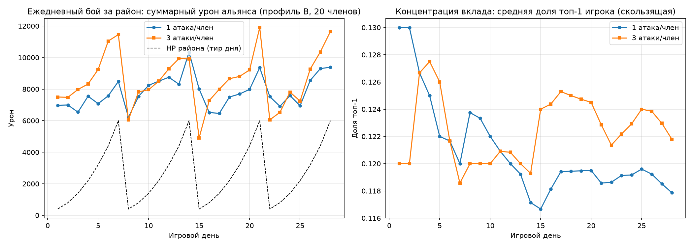

# MECH-12. Альянсы и «Бой за район»

## 1. Методанные

| Поле | Значение |
|---|---|
| ID / версия | MECH-12, v1.0 |
| Редактор | Manus (геймдизайнер проекта) |
| Дата / статус | 2026-08-14 / review |
| Родительский документ | DESIGN-MiniApp-v1.0.0.md, раздел 4.4 «Альянсы и «Бой за район»; GAME_MECHANICS.md (MECH-09 «Агрессия и группы») |
| Согласованные механики | MECH-01 (сутки, окно 19:00–07:00), MECH-01A (сетевой протокол), MECH-03 (HQ и уровень базы), MECH-05 (ресурсы, награды), MECH-11 (атака, урон, потери 40–70%) |
| Прототип / верификация | balance-симуляция `sim_district.py` (28 игровых дней, 3 профиля альянса), графики в `docs/mechanics/` |
| Ассеты | `assets/mech12_raid_flow.png`, `assets/mech12_ally_states.png`, `assets/mech12_chart_district_damage.png`, `assets/sim_district.py` |

**Определение терминов.** Альянс — игровое объединение игроков, привязанное к существующей Telegram-группе: бот добавляется в группу как участник, группа становится альянсом (`ally_id`), лидер альянса — тот, кто прислал группу боту, с правом передачи лидерства. Район — PvE-крепость на общую цель альянса (не база другого игрока): имеет тир (1–7, цикл неделя), HP и ежедневный таймер. Вклад — суммарный урон члена альянса по району за день; награды за зачистку генерируются системой и делятся по доле вклада, а не вычитаются у другой стороны. Сезон — 4-недельный цикл (DESIGN 4.6), внутри которого рейтинг альянса формируется из результатов боёв за район; сезонный пропуск и лидерборд района — смежные системы.

## 2. Назначение

Механика создаёт эстетику **Fellowship** (совместное достижение цели, лидерборд в чате группы, общие награды) и поддерживает **Competition** (сезонный рейтинг альянсов). Ключевой дизайн-принцип, заимствованный у SoS State vs State и CoC Raid Weekends: социальная PvP-активность упакована в **фиксированное ежедневное окно**, а не в перманентную войну — это анти-выгорание, подтверждённое расписанием событий у конкурентов.

**Дизайн-критерий.** Механика успешна, если (1) ≥30% созданных альянсов достигают статуса `qualified` (≥4 активных члена) в первую неделю; (2) среди qualified-альянсов медианная явка в ежедневный бой ≥50% членов; (3) ≥1 сообщение в чат группы про район в сутки (репорт/лайк/объявление рейда). Верификация: аналитика `district_attack_started`, `district_destroyed`, события бота в группах; опрос на 21-й день закрытого теста.

## 3. Обзор и поток взаимодействия

Лидер альянса добавляет бота в Telegram-группу (кнопка «Создать альянс» в Mini App генерирует инструкцию + deeplink добавления бота), бот получает `ally_id` и подтверждает в группу: «Альянс создан. Теперь ваш город сильнее: +10% к производству. Ежедневный бой за район открывается в 19:00». Каждый день 19:00 по игровому времени (MECH-01) открывается окно боя за район на 12 часов: район тира, привязанного к среднему HQ альянса, имеет HP; каждый член может сделать 1 атаку (по формулам MECH-11), добили район — добивший получает +1 бонусную атаку (CoC Raid Weekends); награда-зачистка распределяется по доле вклада. В 07:00 окно закрывается, в группу отправляется репорт дня с лидербордом вклада.

Формальный поток:

| Шаг | Действие игрока | Реакция системы | Результат |
|---|---|---|---|
| 1 | Открывает экран «Район» | `GET /api/district/current` — тир, HP, вклад альянса за день, свой статус атаки | Полоса HP района, список участников |
| 2 | Нажимает «АТАКОВАТЬ» | `POST /api/district/attack` — серверный расчёт (урон = формула мощи MECH-11 × скилл-шум, потери состава по MECH-11) | HP района уменьшается персистентно |
| 3 | Добил район (HP ≤ 0) | Сервер фиксирует добитие, начисляет добившему +1 бонусную атаку, распределяет награду | Награды всем с вкладом >0, пропорционально вкладу |
| 4 | Окно закрывается 07:00 | Бот шлёт в группу репорт: лидерборд вклада (топ-5), итог зачистки, сезонный прогресс | Deep links на профиль и мини-отчёт |
| 5 | Ежедневно | Тир района обновляется (цикл 1–7 за неделю), рейтинг сезона пересчитывается | Длинный хвост сезонного соревнования |

## 4. Формальные правила

### 4.1 Параметры

| Параметр | Значение | Валидный диапазон | Обоснование |
|---|---|---|---|
| Минимум членов для «боевого» альянса | 4 активных за 3 дня | 3–6 | Альянс из 1–2 «спящих» не даёт fellowship-опыта (CoC CWL: ростер от 15, но для TMA порог снижен) |
| Окно боя за район | 19:00–07:00 игрового времени (12 ч) | 8–14 ч | SoS-принцип фиксированного окна; вечерний слот — пик активности Telegram (MECH-09) |
| Атаки члена в окне | 1 | 1–2 | Явка важнее числа атак (симуляция: 3 атаки дают +6% урона при полной явке, но −28% при плохой явке); 2-я и 3-я атаки остаются для личных осад MECH-11 — анти-перегрузка сессии TMA |
| Бонусная атака за добитие | +1, только первому добившему | да/нет | CoC Raid Weekends: стимулирует совместную «добивалку» без бесконечного гринда |
| HP района по тиру T | 400/800/1400/2200/3200/4400/6000 | рост ×1.4–1.8 | Калибровано симуляцией: профиль B (20 членов, 1 атака) зачищает 100%; профиль A (8 членов) — 68% |
| Тир района альянса | min(7, max(1, ⌊средний HQ⌋ + смещение по сезону)) | 1–7 | Матчинг альянса «по силе» — анти-CWL-урок (слабые кланы без матчинга выгорают) |
| Награда-зачистка по тиру T | 120/210/330/480/660/870/1120 badge-единиц + ресурсный кит | рост ×1.4–1.6 | Системная генерация (CoC: Capital Gold не крадётся у жертвы) — награда не делает жертвой другой альянс |
| Минимальная доля для награды | вклад > 0 | — | Anti-leech: без урона нет награды (CWL: медали только атакующим) |
| Деление награды | пропорционально доле вклада; топ-3 вкладчика получают множитель ×1.5/×1.2/×1.1 | ×1.0–2.0 | Сохраняет incentive для средних игроков и не превращает топ-1 в «клан-вампир» |
| Альянс-бонус производства | +10% | +5–15% | DESIGN 4.4; бонус только членам qualified-альянса — без «мёртвых» альянсов ради бонуса |
| Бонус атаки в бою за район | 1.05–1.15 по уровню альянса (MECH-11, вопрос O2) | 1.0–1.2 | Уровень альянса растёт от суммарного вклада за сезон |
| Квота уведомлений бота в группу | 30 msg/с (Bot API) — по проекту ≤5 msg/час на группу | — | DESIGN 4.5; репорт дня = 1 сообщение с inline-кнопками |
| Срок жизни альянса без лидера | 48 ч disputed → 14 дней dormant → dissolution | 24 ч / 7–30 дней | Telegram: группа живёт без админа; игровая механика — нет |
| Сезон | 4 недели (DESIGN 4.6), сезонный пропуск 90 Stars/нед | 3–5 нед | Синхронизация с пропуском «Осада: сезон 1» |

### 4.2 Состояния альянса

Статусная машина: `active → qualified → disputed → dormant → dissolved` (в recovery `dormant → disputed`). Переход `active → qualified` — ≥4 членов с атакой ≥1 раза за последние 3 дня; только qualified-альянсы участвуют в боях и получают бонус производства. Потеря лидера (ушёл из группы / удалил бота) → `disputed`: бот объявляет в чате 48-часовое окно назначения нового лидера командой `/лидер @username` (команду может выполнить только член группы, ранее делавший атаки). Превышение 48 ч → `dormant`: бой за район недоступен, уведомления остановлены; возвращение лидера в 14 дней → `disputed` → `qualified` при выполнении критериев; иначе `dissolved` — участники остаются в своих городах без альянс-бонуса, сезонные награды сохранены. Серверный владелец состояний (MECH-01A), клиент — только отображение.

### 4.3 Формулы

**Тир района.**

`T = min(7, max(1, ⌊mean(HQ_i)⌋ + ⌊(season_day / 7)⌋))`

где `HQ_i` — уровни HQ активных членов альянса за 7 дней; сезонное смещение +1 тир в неделю держит конец сезона напряжённым для топовых альянсов (аналог «недельных лиг» CWL).

**Вклад члена за окно.**

`contribution_j = Σ_k (u_jk × 12 × B_alliance × skill_jk)`

где сумма по атакам k члена j в окне, `u_jk` — число отправленных юнитов, `skill_jk` — мультипликатор 0.8–1.2 (калибровочный шум урона, как в MECH-11 потери). Урон персистентен между атаками (CoC Raid Weekends): HP района — общий аккумулятор, атака следующего члена продолжает с места остановки.

**Награда члена.**

`reward_j = R_T × (contribution_j / Σ contribution) × M_rank(j)`

где `R_T` — награда-зачистка тира (4.1), `M_rank` — множитель по месту в лидерборде вклада (1.5 / 1.2 / 1.1 для топ-3, 1.0 для остальных). Без зачистки района (HP > 0 в 07:00) награда не выдаётся, но вклад сохраняется в «копилку» — если район добит следующим днём, накопленный вклад предыдущих дней входит в деление (анти-наказание за «не добили сегодня»).

**Рейтинг сезона.**

`rating = Σ_дней (R_T × I(зачистка)) + 0.2 × Σ_дней (contribution / district_HP)`

где первая часть — награды зачисток (качество), вторая — доля «перевыполнения» (объём: альянс, который добивает район за 40% окна, сильнее того, кто barely доживает до 07:00). Рейтинг обновляется ежедневно в 07:00, лидерборд сезона — экран в Mini App + weekly-репорт бота.

## 5. Интеграция с другими системами

| Система | Точка интеграции | Передаём | Ожидаем |
|---|---|---|---|
| MECH-11 (осада) | Формулы урона/потерь; бонус атаки `B_alliance`; реванш-логика не применяется (район — PvE) | Состав юнитов, HQ члена | Урон, потери 40–70%, счётчики атак окна |
| MECH-01 / MECH-01A (тики) | Окно 19:00–07:00; итог дня — утренний тик; события `district_attack_started`, `district_destroyed` | world_clock | Персистентность HP между тиками; ретроспектива оффлайн-членов |
| MECH-03 (город) | HQ члена → тир района; +10% производство — модификатор коллекторов | HQ-уровень | Бонус применяется в формулах MECH-05 |
| MECH-05 (ресурсы) | Награда-зачистка → ресурсный кит + badge-единицы (не жидкие ресурсы другого игрока) | ID альянса, тир | Атомарное начисление награды (SELECT FOR UPDATE по `alliance_id`) |
| Telegram Bot API (DESIGN 4.5) | Создание альянса через группу; репорт дня; объявление рейда | ally_id, группа chat_id | Сообщения ≤5/час, deep links, inline-кнопки |
| Сезонный пропуск (DESIGN 4.6) | Рейтинг сезона → задачи пропуска; флаги-косметика | сезонные события | Зачёт задач, визуальные награды |
| Задания / ежедневки | «Внеси вклад в бой за район» — ежедневная задача Tier 3 | district-события | Зачёт задания, награда опыта |

## 6. Edge cases

| # | Сценарий | Поведение системы |
|---|---|---|
| E1 | Член вышел из альянса в окне боя | Вклад за текущее окно сохраняется (уже нанесён), награда за него начисляется даже после выхода (CoC: покинувшие получают медали); доступ к следующим окнам потерян |
| E2 | Член оффлайн весь день окна | Не получает награду дня; репорт бота показывает его место как «—»; следующий день — полное право участвовать |
| E3 | Лидер удалил бота из группы | Альянс → `disputed` немедленно; команда `/лидер` доступна всем членам с атаками; 48-часовой таймер в чате |
| E4 | Два члена одновременно нажали «АТАКОВАТЬ» | Серверная очередь по атакам (MECH-01A интент-идемпотентность); HP — один аккумулятор, race condition исключён блокировкой `alliance_id` |
| E5 | Район не зачищен к 07:00 | HP переносится на следующий день (персистентность CoC); вклад дня входит в «копилку» следующего дня; награда делится с учётом накопленного вклада |
| E6 | Альянс из 3 активных членов (не qualified) | Доступ к району закрыт; бонус производства не действует; бот подсказывает в чате «приведите ещё 1 товарища» |
| E7 | Квота бота: группа переполнена уведомлениями | ≤5 msg/час на группу (DESIGN 4.5); репорт дня — 1 сообщение; «объявление рейда» — по команде `/рейд`, а не по триггеру каждого члена |
| E8 | Игрок в двух Telegram-группах с ботом | Один игрок → один альянс (`user_id` unique); попытка второй привязки → код `ALREADY_IN_ALLIANCE` с инструкцией выхода |
| E9 | Смена тира района посреди окна (не происходит) | Тир фиксируется на 19:00 по snapshot среднего HQ; изменения состава не пересчитываются до следующего дня (snapshot-правило MECH-11) |
| E10 | Игрок с щитом MECH-11 в окне боя за район | Щит не блокирует район (PvE); но личные осады MECH-11 под щитом штрафуются по MECH-11 — системы не конфликтуют |
| E11 | «Мёртвый» альянс: 0 атак 7 дней | Автоматическое уведомление бота на 5-й день; на 7-й день — предупреждение о потере бонуса; dissolution только по потере лидера (E3) — иначе принудительный роспуск демотивирует |
| E12 | Сезон закончился, альянс распался | Награды сезона сохранены у участников; рейтинг заморожен; новый сезон — новая возможность; косметика-флаги не отбираются |

## 7. Доказательная база

| Механика референса | Параметры | Берём / адаптируем / отбрасываем | Источник |
|---|---|---|---|
| CoC Raid Weekends: еженедельное окно, суммарный урон по районам, персистентное HP, бонусная атака за добитие | пт 7:00 UTC – пн 7:00 UTC; 5 атак/игрок; +1 за первый добивающий удар | Берём персистентный HP и +1 за добитие; адаптируем окно в 12 ч/сутки (TMA-ритм короче уикенда); отбрасываем 5 атак/игрок (наш лимит 1, см. 4.1) | clashofclans.fandom.com/Raid_Weekends (ур.4) |
| CoC Raid Weekends: награда генерируется системой, не крадётся у жертвы | Capital Gold — новый ресурс игры | Берём целиком: награды боя за район — системные badge-единицы + киты ресурсов; PvP-альянс не становится жертвой (DESIGN: бой за район — PvE, не альянс-PvP) | clashofclans.fandom.com/Raid_Weekends (ур.4) |
| CoC Clan Wars: лучшая атака, звёзды, тайбрейкер % разрушения | 1★=50%, 2★=Town Hall, 3★=100%; суммарное разрушение — тайбрейкер | Адаптируем тайбрейкер: сезонный рейтинг = награды зачисток + 20% «перевыполнение» (4.3); звёзды не переносим (нет Town Hall-цели) | support.supercell.com (ур.1) |
| CWL: сезон 8 дней, 7 войн round-robin, лиги, промоушен/демоушен | группы по 8 кланов, медали по позиции группы | Берём сезонность (4 недели, DESIGN 4.6) и рейтинг; отбрасываем лиги-промоушен в MVP (социальный слой TMA не держит пирамиду лиг без критической массы) — перенос в v0.3 при ≥500 активных альянсов | clashofclans.fandom.com/Clan_War_Leagues (ур.4) |
| CWL: награды только атакующим, лидер может наградить лучших | медали только участникам ростера | Берём «награда по вкладу» + множитель топ-3 (4.1); отбрасываем ручное распределение лидером (анти-токсичность, Telegram-группа не модерирует игру) | clashofclans.fandom.com/Clan_War_Leagues (ур.4) |
| SoS State vs State: фиксированное расписание события, коллективный счёт, удержание | 8 ч удержания столицы / 24 ч суммарно | Берём фиксированное окно; отбрасываем удержание столицы (нет live-PvP в async-модели проекта) | sites.google.com/sos-guide-en (ур.3) |
| Antipattern: CWL без матчинга для слабых кланов | матч только по лиге, новые кланы не проходят | Берём митигацию: тир района по среднему HQ + сезонное смещение (4.3); слабые альянсы всегда зачищают свой тир при нормальной явке (подтверждено профилем A: 68% зачисток при 8 членах) | Reddit r/ClashOfClans, ур.5 (сигнал боли) |
| Antipattern: «клан-вампир» — афк-члены получают бесплатно | CWL медали всем ростеру | Отбрасываем: наша награда — только с вкладом >0; топ-3 множитель вместо «лидер раздаёт бонусы» | CoC CWL vs наш дизайн (ур.4, контраст) |

Сравнительная матрица: по «совместной цели» лидирует CoC Raid Weekends (персистентный HP + добитие) — ядро MECH-12; по «сезонности» — CWL (рейтинг, но без лиг в MVP); по «расписанию» — SoS (фиксированное окно). Antipattern-защита: матчинг по HQ + награда только за вклад.

## 8. Адаптация под проект

**Назначение.** Fellowship переопределён под фэнтези: не «клановая лига», а «ополчение города» — язык уведомлений («Соседи, мародёры у ворот района!», «Район зачищен — каждый получил свою долю»). Бой за район — коллективная защита/зачистка окрестностей города, а не война кланов.

**Контекст.** В отличие от CoC у нас нет live-атак: бой за район — чистый async-аккумулятор урона в окне 19:00–07:00, что согласуется с MECH-01A (тики, polling). В отличие от SoS нет удержания территории — победа = зачистка, а не удержание (async-модель не поддерживает live-контроль).

**Ограничения.** Telegram-группа = альянс: это и сила (нативный чат, нулевой cost координации), и риск (группа может удалить бота) — митигация стат machine `disputed/dormant` (4.2). Квота Bot API 30 msg/с — митигация ≤5 msg/час на группу (E7).

**Дифференциация.** Три связки: (1) альянс = Telegram-группа без отдельной внутриигровой инфраструктуры — координация там, где игроки уже есть; (2) «копилка» непеределанного вклада (E5) — альянсу не нужно добивать в один день, что снижает ежедневное давление; (3) рейтинг сезона с 20% «перевыполнением» — поощряет не «едва зачистить», а зачистить быстро, давая сезонную глубину без лиг.

## 9. Баланс и экономика

Балансная модель — `assets/sim_district.py` (28 игровых дней ≈ 4,7 суток РТ; seed 42; параметры согласованы с MECH-11: сила юнита 12, потери 40–55% в победе). Три профиля:

| Профиль | Состав | Явка | Бонус | Зачистки | Средний топ-1 share |
|---|---|---|---|---|---|
| A: «малый альянс» | 8 членов, HQ 1–3 | 60% | 1.05 | 68% | 35% |
| B: «золотая середина» | 20 членов, HQ 1–3 | 85% | 1.10 | 100% | 11% |
| C: «крупный» | 30 членов, HQ 1–3 | 95% | 1.15 | 100% | 7% |

Выводы симуляции. (1) Профиль B зачищает 100% районов тира при 1 атаке/член — тир-матчинг по среднему HQ работает: альянсу не нужен гринд. (2) Профиль A зачищает 68% — малые альянсы терпят поражения, что создаёт «подъём по сезону» (мотивация приглашать ещё членов), но не вылетают полностью — анти-CWL-урок подтверждён. (3) Концентрация вклада: в малых альянсах топ-1 даёт 35% урона (риск «клан-вампир», смягчён делением награды по доле — топ-1 получит 35% награды, а не 100%); в крупных — 7–11%. (4) Явка важнее числа атак: переход с 1 до 3 атак/член при полной явке даёт +6% урона, но при падении явки до 50% урон падает на 28% — подтверждение дизайна «1 атака/член + бонус за добитие».

Что балансируется на препродакшене (структура): HP-кривая тиров, порог qualified (4 члена), множители топ-3. Что балансируется на продакшене (числа): бонус альянса 1.05–1.15 (вопрос O2 из MECH-11), награды `R_T`, сезонное смещение тиров — по событиям `district_destroyed`/`district_attack_started` и явке из аналитики.

## 10. UX/UI-влияние

Экран «Район» (мокап `ui-district-mockup.png`): сверху — карта района (стиль фэнтези: заброшенный квартал с руинами), полоса HP с числом и вкладом альянса; под ней — мой вклад сегодня и кнопка «АТАКОВАТЬ» (disabled, если лимит 1 исчерпан); ниже — лидерборд дня (топ-5) и сезонный прогресс альянса. Состояния loading/disabled обязательны (TMA-правило DESIGN 5.2). Экран «Альянс»: список членов, статус (`qualified / disputed / dormant`), бонус +10%, кнопка «Пригласить» (deeplink в Telegram с текстом-приглашением).

Уведомления бота в группу (5 шаблонов): «Альянс создан» (инструкция лидерства); «Окно района открыто — мародёры у ворот» (19:00, 1/день); репорт дня с лидербордом (07:00, 1/день); «Новый лидер назначен» (disputed); «Ваш альянс потерял лидера — назначьте нового за 48 ч». Все сообщения с inline-кнопками и deep links.

## 11. Технические заметки

**HP-аккумулятор района.** Единый accumulator `district_hp` на `alliance_id + day_key` (day_key = дата по `world_clock` MECH-01A); обновление — `UPDATE ... SET hp = GREATEST(0, hp − dmg)` в транзакции с блокировкой `alliance_id` (E4). Персистентность между днями (E5) — отдельная строка `district_state` с TTL на сезон.

**Расчёт урона.** Серверный, по формулам MECH-11; клиент получает только предпросмотр (состав, ожидаемый урон ±шум). Snapshot среднего HQ на 19:00 (E9) — аналогично snapshot осады MECH-11.

**Бот-слой.** Один chat_id = один ally_id; команды `/лидер`, `/рейд`, `/статус`; квота ≤5 msg/час на группу; репорт дня — одно сообщение с inline-кнопками «Мой вклад», «Сезон». События `district_*` — в ту же шину `pending_player_events` (MECH-01A), что и осады.

**Нагрузка.** Пик окна: 1 атака/член × N qualified; при 10 000 игроков × 30% qualified × 1 атака = 3 000 атак за 12 часов ≈ 4 атаки/минуту — тривиально для cron-обработки MECH-01A. Лидерборд дня — materialized view, обновляется по каждой атаке.

## 12. Риски, открытые вопросы и changelog

**Риски.** (а) «Мёртвые» группы: игрок создал альянс, пригласил 2 друзей и забросил — митигация: бонус только qualified (≥4 активных), E11-уведомления; dissolution только при потере лидера. (б) Доминирование топ-1 в малых альянсах (35% урона) — митигация: деление награды по доле вклада + множитель топ-3 (не «всё победителю»), при этом вклад топ-1 всё равно ценен для альянса — баланс «важен, но не единственный». (в) Окно 19:00–07:00 может не совпасть с часовыми поясами части аудитории (проект ориентирован на СНГ/восточную Европу — окно покрывает вечер МСК и утро Дальнего Востока частично) — митигация: на продакшене анализируем распределение атак по часам; если обнаружится второй пик — смещение окна по сегментам. (г) Сезонное смещение тиров (+1/неделя) может «обогнать» прогресс слабого альянса — митигация: смещение привязано к среднему HQ (растёт вместе с прогрессом), а не к календарю.

**Открытые вопросы.** O1: значение «badge-единицы» (медаль) — трата у трейдера или косметика? Решение до 2026-09-01, ответственный: геймдизайнер (смежно с MECH-10 Stars-экономикой). O2: лиги альянсов в сезоне (v0.3 при ≥500 активных альянсов) — решение после первого сезона. O3: бонус атаки `B_alliance` 1.05–1.15 по уровню альянса — тот же O2 из MECH-11, решение до 2026-09-15.

| Дата | Версия | Изменение | Причина |
|---|---|---|---|
| 2026-08-14 | v1.0 | Первый выпуск: альянс = Telegram-группа, ежедневный бой за район, сезон, balance-симуляция 28 дней | Перенос DESIGN 4.4 в feature-doc |
