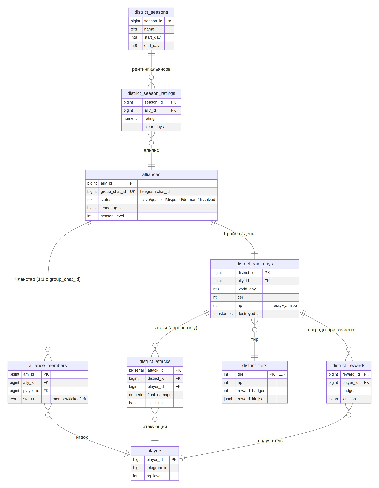

# MECH-12. Импл (IMPL): альянсы и «Бой за район» — схема БД и серверная реализация

| Поле | Значение |
|---|---|
| ID / версия | MECH-12-IMPL, v1.0 |
| Дата / статус | 2026-08-14 / review |
| Родительский документ | MECH-12-alliance.md (feature-doc), GAME_MECHANICS.md §MECH-01A (сетевой протокол) |
| Аудитория | Бэкенд-разработчики (Python/FastAPI, asyncpg, aiogram), DBA |
| Платформа | PostgreSQL 16+, FastAPI, aiogram 3.x, Heartbeat-cron платформы |

Документ переводит feature-правила MECH-12 в исполняемые артефакты: DDL-схему PostgreSQL (совместимую с конвенциями GAME_MECHANICS §MECH-01A), серверные хендлеры, тик-интеграцию и бот-слой. Где feature-doc MECH-12 и этот документ расходятся — приоритет у feature-doc, изменение фиксируется через changelog.

## 1. Общая архитектура и конвенции

Механика строится целиком на конвенциях MECH-01A: единые мировые часы `world_clock`, серверный тик с advisory-локом, интент-модель клиентов (клиент никогда не считает действие выполненным до `2xx`), `pending_player_events` как шина персонально-адресованных событий и ретроспектива оффлайн-игроков. Альянсы — единственный слой проекта, где данные принадлежат **группе**, а не игроку, поэтому вводится домен `ally_*` со своими статусными машинами; район-бой живёт поверх домена `district_*`. Все мутации — в транзакциях PostgreSQL, хроннометраж — только `statement_timestamp()`.

Именование таблиц: snake_case, множественное число (`alliances`, `district_raid_days`); журналы — append-only с суффиксом лога события (`district_attack_log`); материализованные витрины — суффикс `_mv` (обслуживаются вручную, не триггерами, чтобы логика оставалась в прикладном коде). Связи игрока с альянсом — таблица членства с историей (soft-запись выхода), без физ. удаления строк (восстановление истории членства в спорах о лидерстве, E-диспуты 4.2 feature-doc).

## 2. Схема БД (DDL). ER-диаграмма домена:



```sql
-- =============================================================
-- ДОМЕН ALLIANCES: альянс = Telegram-группа
-- =============================================================
CREATE TABLE alliances (
    ally_id          bigserial PRIMARY KEY,
    group_chat_id    bigint NOT NULL UNIQUE,        -- Telegram chat_id (group), уникальный по конвенции 1:1
    name             text NOT NULL,
    status           text NOT NULL DEFAULT 'active'
                     CHECK (status IN ('active','qualified','disputed','dormant','dissolved')),
    leader_tg_id     bigint,                        -- telegram_id лидера; NULL при disputed
    created_at       timestamptz NOT NULL DEFAULT now(),
    status_changed_at timestamptz NOT NULL DEFAULT now(),
    season_level     int NOT NULL DEFAULT 1,        -- уровень альянса: растёт от суммарного сезонного вклада
    season_xp        numeric(14,2) NOT NULL DEFAULT 0, -- для порога перехода на след. уровень
    dissolved_at     timestamptz                    -- мягкое удаление; dissolution — логическое
);
CREATE INDEX idx_alliances_status ON alliances (status) WHERE status NOT IN ('dissolved');

-- Членство: игрок ∈ группа Telegram в момент синхронизации чата.
-- sync_source: 'tg_members' — по API getChatMember (бот-полл), 'manual' — заявка из Mini App,
--              'left' — игрок вышел из группы.
CREATE TABLE alliance_members (
    am_id            bigserial PRIMARY KEY,
    ally_id          bigint NOT NULL REFERENCES alliances (ally_id),
    player_id        bigint NOT NULL REFERENCES players (player_id), -- FK на домен игроков MECH-01
    status           text NOT NULL DEFAULT 'member'
                     CHECK (status IN ('member','kicked','left')),
    joined_at        timestamptz NOT NULL DEFAULT now(),
    left_at          timestamptz,
    sync_source      text NOT NULL DEFAULT 'tg_members'
);
CREATE UNIQUE INDEX idx_am_active ON alliance_members (ally_id, player_id)
    WHERE status = 'member';
CREATE INDEX idx_am_player ON alliance_members (player_id) WHERE status = 'member';

-- Активность для критерия qualified: ≥4 членов с атакой ≥1 за последние 3 дня.
-- Таблица агрегирует атаки (заполняется триггером-приложением в атаке, не триггером БД —
-- через тот же сервисный слой, что и district_attacks).
CREATE TABLE alliance_activity (
    ally_id          bigint NOT NULL,
    world_day        int8 NOT NULL,
    active_members   int NOT NULL DEFAULT 0,      -- COUNT(DISTINCT player_id) с attack за день
    PRIMARY KEY (ally_id, world_day)
);
-- Rolling-окно 3 дня вычисляется запросом SUM по дням [d-2, d]; индекс по (ally_id, world_day) —
-- покрывающий (таблица уже PK-индексирована).

-- =============================================================
-- ДОМЕН DISTRICT: бой за район
-- =============================================================

-- Справочник тиров (калибровка feature-doc 4.1)
CREATE TABLE district_tiers (
    tier             int PRIMARY KEY CHECK (tier BETWEEN 1 AND 7),
    hp               int NOT NULL,
    reward_badges    int NOT NULL,                 -- badge-единицы (системная награда, не кража)
    reward_kit_json  jsonb NOT NULL DEFAULT '{}'   -- ресурсный кит: {"wood":30, "steel":12, ...}
);
INSERT INTO district_tiers (tier, hp, reward_badges, reward_kit_json) VALUES
    (1,  400,  120, '{"wood":20,  "parts":8}'),
    (2,  800,  210, '{"wood":30,  "steel":6, "meds":1}'),
    (3, 1400,  330, '{"steel":10, "parts":12, "meds":2}'),
    (4, 2200,  480, '{"steel":15, "parts":18, "meds":3, "fuel":4}'),
    (5, 3200,  660, '{"steel":20, "parts":24, "meds":4, "fuel":6, "rare_parts":1}'),
    (6, 4400,  870, '{"steel":25, "parts":30, "meds":5, "fuel":8, "rare_parts":2}'),
    (7, 6000, 1120, '{"steel":30, "parts":36, "meds":6, "fuel":10,"rare_parts":3, "veteran_token":1}');

-- Район: PvE-крепость. В MVP — 1 район на альянс в день (привязка по ally_id + world_day);
-- масштабируется до нескольких районов на группу альянсов при >=500 активных альянсов (v0.3, O2).
CREATE TABLE district_raid_days (
    district_id      bigserial PRIMARY KEY,
    ally_id          bigint NOT NULL REFERENCES alliances (ally_id),
    world_day        int8 NOT NULL,                -- день, к которому относится район (day_key)
    tier             int NOT NULL REFERENCES district_tiers (tier),
    hp               int NOT NULL,                 -- аккумулятор: GREATEST(0, hp - dmg)
    destroyed_at     timestamptz,                  -- момент HP<=0 (для добития-бонуса и репорта)
    destroyed_by     bigint,                       -- player_id добившего (+1 бонусная атака)
    cleared_by       int8,                         -- world_day фактической зачистки (для «копилки»)
    created_at       timestamptz NOT NULL DEFAULT now()
);
CREATE UNIQUE INDEX idx_district_day ON district_raid_days (ally_id, world_day);
CREATE INDEX idx_district_pending ON district_raid_days (world_day, district_id) WHERE destroyed_at IS NULL;

-- Лог атак: append-only, источник истины для вкладов, лидерборда и анти-чит-аудита.
CREATE TABLE district_attacks (
    attack_id        bigserial PRIMARY KEY,
    district_id      bigint NOT NULL REFERENCES district_raid_days (district_id),
    ally_id          bigint NOT NULL,
    player_id        bigint NOT NULL,
    world_day        int8 NOT NULL,
    units_count      int NOT NULL CHECK (units_count BETWEEN 5 AND 60), -- константа MECH-11
    units_json       jsonb NOT NULL,               -- состав: [{"kind":"militia","n":8}, ...]
    raw_damage       numeric(10,2) NOT NULL,       -- урон по формуле MECH-11 до применения бонусов
    final_damage     numeric(10,2) NOT NULL,       -- с учётом B_alliance, skill-шума
    hp_before        int NOT NULL,
    hp_after         int NOT NULL,
    is_killing       bool NOT NULL DEFAULT false,  -- эта атака <= 0 HP (фиксирует добитие)
    created_at       timestamptz NOT NULL DEFAULT now()
);
CREATE INDEX idx_attacks_day ON district_attacks (district_id, world_day);
CREATE INDEX idx_attacks_player_day ON district_attacks (player_id, world_day);

-- Витрина лидерборда дня (materialized view, обновляется вручную после каждой атаки/очистки
-- в утреннем тике — см. 4.2; не auto-refresh, чтобы не плодить фоновые процессы).
CREATE MATERIALIZED VIEW district_daily_contribution AS
SELECT d.ally_id, d.world_day, a.player_id,
       SUM(a.final_damage) AS contribution,
       RANK() OVER (PARTITION BY d.district_id ORDER BY SUM(a.final_damage) DESC) AS rank_in_raid
FROM district_attacks a
JOIN district_raid_days d USING (district_id, ally_id, world_day)
GROUP BY d.ally_id, d.world_day, a.player_id, d.district_id;

-- Награды зачистки: начисляются атомарно (SELECT FOR UPDATE по ally_id) в утреннем тике
-- или при фактической зачистке (для дожития до следующего дня — «копилка», feature-doc 4.3).
CREATE TABLE district_rewards (
    reward_id        bigserial PRIMARY KEY,
    district_id      bigint NOT NULL,
    player_id        bigint NOT NULL,
    badges           int NOT NULL,                 -- badge-единицы на счёт игрока
    kit_json         jsonb NOT NULL,               -- уже разложенный кит на ресурсы игрока
    applied_at       timestamptz NOT NULL DEFAULT now()
);

-- Сезон: 4-недельный цикл (DESIGN 4.6), привязка к world_day через глобальные границы.
CREATE TABLE district_seasons (
    season_id        bigserial PRIMARY KEY,
    name             text NOT NULL,                -- «Осада: сезон 1»
    start_day        int8 NOT NULL UNIQUE,
    end_day          int8 NOT NULL,
    status           text NOT NULL DEFAULT 'open' CHECK (status IN ('open','closed'))
);

-- Сезонный рейтинг альянсов (вита, пересчёт 07:00 ежедневным тиком; формула feature-doc 4.3):
-- rating = SUM(R_T * I(clear)) + 0.2 * SUM(contribution / district_HP)
CREATE TABLE district_season_ratings (
    season_id        bigint NOT NULL REFERENCES district_seasons (season_id),
    ally_id          bigint NOT NULL,
    rating           numeric(14,2) NOT NULL DEFAULT 0,
    clear_days       int NOT NULL DEFAULT 0,
    updated_at       timestamptz NOT NULL DEFAULT now(),
    PRIMARY KEY (season_id, ally_id)
);

-- =============================================================
-- ИНТЕГРАЦИЯ: события в шину pending_player_events и уведомления
-- =============================================================
-- События домена (payload_json):
--   district_window_opened   { ally_id, district_id, tier }
--   district_attack_started  { ally_id, player_id, damage, hp_after }
--   district_destroyed       { ally_id, player_id (killer), reward_badges }
--   district_reward_applied  { player_id, badges, kit }
--   district_day_report      { ally_id, world_day, tier, destroyed, top5[] }
--   ally_status_changed      { ally_id, old_status, new_status, reason }
```

Внешние зависимости схемы (домены MECH-01A): `players` (игрок, telegram_id, HQ из MECH-03), `world_clock` (world_day, day_started_at), `world_ticks` (журнал тиков), `pending_player_events` (шина оффлайн-ретроспективы). FK `district_rewards.player_id → players` разворачивается при реализации MECH-05-счётчиков; до готовности — `bigint NOT NULL` без ограничения.

## 3. Серверные хендлеры (FastAPI)

Все мутационные эндпоинты — транзакции с проверкой мира внутри (снимок `statement_timestamp()`), авторизация по middleware MECH-01A (`initData` HMAC). Коды ошибок из таблицы MECH-01A §1.13 пополняются доменными кодами MECH-12.

| Эндпоинт | Контракт | Транзакция / блокировки |
|---|---|---|
| `POST /api/alliance/create` | `{ group_chat_id }` — лидер добавил бота в группу; проверка `getChatMember` (бот — админ) | INSERT alliances + member (leader) |
| `POST /api/alliance/join` | deeplink из приглашения; проверка `getChatMember(player)` | INSERT alliance_members (существующий `kicked`/`left` — восстановление записи) |
| `GET /api/alliance/status` | статус, членство, qualified-критерий, бонус | read-only |
| `POST /api/alliance/leave` | выход из группы/альянса | UPDATE status='left' |
| `POST /api/bot/leader` | команда бота `/лидер @username`; только член группы с историей атак | UPDATE leader_tg_id |
| `GET /api/district/current` | тир, HP, вклад альянса за день, мой лимит атаки | read-only (snapshot среднего HQ по `world_day`) |
| `POST /api/district/attack` | интент атаки: `{ units_json }`; ответ `{ raw_damage, final_damage, hp_after, bonus_attack, contribution }` | advisory lock `pg_advisory_xact_lock('district', ally_id)` — единый аккумулятор HP; счётчик 1 атака/игрок/день через unique-проверку на `district_attacks` (player_id, world_day) |
| `POST /api/district/cleanup` (внутр. cron) | итог дня: HP ≤ 0 → награды; HP > 0 → копилка; репорт бота | FOR UPDATE по `alliance_id`; INSERT district_rewards атомарно |

Ключевая транзакция `POST /api/district/attack` (псевдокод сервиса):

```python
async def district_attack(conn, player_id, units_json):
    day = await world_clock.current_day(conn)          # SELECT world_day FROM world_clock
    # 1. Квалификация альянса: active members за 3 дня (alliance_activity) — только qualified
    ally = await conn.fetchrow("SELECT ally_id, status FROM alliances "
                               "JOIN alliance_members m USING (ally_id) WHERE m.player_id=$1 AND m.status='member'", player_id)
    if ally.status != 'qualified': raise GameError('DISTRICT_NOT_QUALIFIED')
    # 2. Лимит 1 атака/игрок/день (бонусная от добития учитывается в отдельном флаге bonus_attack)
    await conn.execute("SELECT 1 FROM district_attacks WHERE player_id=$1 AND world_day=$2", player_id, day)
    # 3. Дневной район (или создание на лету: тир по формуле T = min(7, max(1, floor(avg HQ)+floor(season_day/7))))
    district = await get_or_create_district(conn, ally.ally_id, day)
    # 4. Блокировка аккумулятора + атомарное уменьшение HP
    async with conn.transaction():
        await conn.execute("SELECT pg_advisory_xact_lock('district'::regclass::int, $1)", district.district_id)
        row = await conn.fetchrow("SELECT hp FROM district_raid_days WHERE district_id=$1 FOR UPDATE", district.district_id)
        dmg = compute_damage(units_json, B_alliance(ally))   # формула MECH-11 × skill-шум
        hp_after = max(0, row.hp - dmg)
        killing = hp_after == 0
        await conn.execute("""INSERT INTO district_attacks (...)""")
        await conn.execute("UPDATE district_raid_days SET hp=$1, destroyed_at=$2, destroyed_by=$3 WHERE district_id=$4",
                           hp_after, now() if killing else None, player_id if killing else None, district.district_id)
    # 5. Офлайн-члены альянса увидят итог в ретроспективе: событие -> pending_player_events
    await publish_player_event(conn, ally.ally_id, 'district_attack_started', {...})
    # 6. Лидерборд: refresh по (ally_id, day) после вставки (ручная материализация, 4.2)
```

Античит-граница совпадает с MECH-11: состав юнитов, HQ и расчёт — только сервер; клиент получает предпросмотр ожидаемого урона ±шум (поле `preview` у `GET /api/district/current`, без `final_damage`). Snapshot среднего HQ для тира фиксируется в 19:00 (начало окна) — отдельная запись `district_raid_days.tier`, чтобы внутри дня тир не «гулял» от входа/выхода членов (feature-doc E9).

## 4. Тик-интеграция (Heartbeat-cron)

Утренний тик `WorldTicker.tick(world_day)` в `REPEATABLE READ` получает фазу district-обработки: (1) для всех `district_raid_days` с `world_day = today-1` и `destroyed_at IS NULL` — «район не добит»: вклад копится (назначение `cleared_by` при зачистке следующим днём); (2) для `destroyed_at IS NOT NULL` — начисление наград `district_rewards` через `SELECT FOR UPDATE` по `alliance_id` с долей вклада и топ-3 множителем; (3) пересчёт `alliance_activity` за [d-2, d] и переключение статуса `active ↔ qualified`; (4) пересчёт `district_season_ratings`; (5) формирование payload репорта дня и запись события `district_day_report` в шину; (6) бот-слой отправляет репорт в группу (квота ≤5 msg/час, репорт = 1 сообщение с inline-кнопками «Мой вклад», «Сезон»). Открытие окна 19:00 — отдельный фаза-тикер в `dusk` (MECH-01): событие `district_window_opened` всем членам qualified-альянсов.

Нагрузка (feature-doc §11): пик ≈4 атаки/мин, тик-обработка района — O(1) по формулам, материализация лидерборда — по каждой атаке (обновление только строки дня альянса, не всей таблицы). Ретроспектива оффлайн-членов — стандартная очередь `pending_player_events` по `world_day_due`.

## 5. Бот-слой (aiogram)

Один `chat_id` = один `ally_id` (FK `alliances.group_chat_id`). Хендлеры команд: `/лидер` (назначение, только qualified+disputed, с проверкой членства), `/рейд` (статус окна + HP), `/статус` (краткий статус альянса). Полл Telegram-членов: aiogram-фоновая задача каждые 15 мин вызывает `getChatMembersCount` + `getChatMember` для активных (sync-источник `tg_members`); отставание ≤15 мин приемлемо (критерий qualified — по 3 дням). Уведомления: 5 шаблонов (создание, окно открыто, репорт, disputed 48 ч, потеря лидера 14 дней) с inline-кнопками и deep links. Ограничение Bot API 30 msg/с на бота — по проекту не более 5 msg/час на группу, диспетчер уведомлений агрегирует события окна в один репорт.

## 6. Edge cases реализации (E-дополнения)

| E-код | Случай | Поведение в коде |
|---|---|---|
| E-DB1 | Race: 2 члена альянса одновременно атакуют | Advisory lock `pg_advisory_xact_lock('district', district_id)` сериализует аккумулятор HP; обе атаки исполнятся, но последовательно (не 409 — последовательность атак валидна) |
| E-DB2 | Игрок вышел из Telegram-группы в окне боя | aiogram-полл фиксирует `left`; атака в окне засчитана (событие уже произошло), бонус и награда сохраняются — не откатываем свершившееся |
| E-DB3 | Лидер удалён из группы до выполнения `/лидер` | Бот шлёт в группу уведомление `ally_status_changed → disputed` с дедлайном 48 ч; атаки в окне невозможны до переключения в qualified |
| E-DB4 | Альянс распущен (dissolved) в середине сезона | Сезонные награды сохранены (immutable `district_rewards`), рейтинг заморожен; участники остаются в городах без бонуса |
| E-DB5 | «Копилка» не зачистилась до конца сезона | Копилка обнуляется с закрытием сезона (правило «переигрывается»); уведомление в репорт последнего дня сезона |
| E-DB6 | Игрок в 2+ группах с ботом (мульти-альянс) | Ограничение `idx_am_active` по `player_id` + unique-проверка на вступление; второе вступление — отказ `MULTI_ALLIANCE_FORBIDDEN` |
| E-DB7 | Тик не отработал день (авария cron) | `CATCHUP_MODE=full` (MECH-01A): награды зачисток применяются ретроспективно; репорт отправляется с задержкой, бот помечает «репорт за день N» |
| E-DB8 | Член альянса сменил telegram-аккаунт | Привязка по `player_id` (не telegram_id напрямую) — смена Telegram-аккаунта не рвёт членство |

## 7. Миграции и декомпозиция внедрения

Внедрение разбивается на 4 этапа без блокировки существующих механик: (1) таблицы `alliances` + `alliance_members` + бот-слой создания — альянсы без боя; (2) `district_tiers` + `district_raid_days` + `district_attacks` — бой без наград; (3) `district_rewards` + тик-интеграция наград — полная экономика; (4) `district_seasons` + `district_season_ratings` + сезонный лидерборд. Каждый этап — отдельная миграция Alembic с `down`-скриптом; индексы после таблиц, витрина `district_daily_contribution` создаётся на этапе 2 и пересобирается на этапе 3 (при изменении формулы вклада).

## 8. Changelog

| Дата | Версия | Изменение | Причина |
|---|---|---|---|
| 2026-08-14 | v1.0 | Первый выпуск: DDL (alliances, district_raid_days, district_attacks, rewards, seasons), хендлеры, тик-интеграция, бот-слой, 8 E-дополнений | Перевод feature-doc MECH-12 в исполняемую спецификацию |

## References

[1]: /docs/mechanics/MECH-12-alliance.md "MECH-12 feature-doc (родительский документ)"
[2]: /docs/mechanics/GAME_MECHANICS.md "GAME_MECHANICS §MECH-01A: сетевой протокол и синхронизация тиков"

- [1] MECH-12-alliance.md — формулы, параметры, edge cases feature-уровня; приоритет при расхождениях.
- [2] GAME_MECHANICS.md §MECH-01A — конвенции world_clock, advisory lock, интент-модель, polling, коды ошибок.
